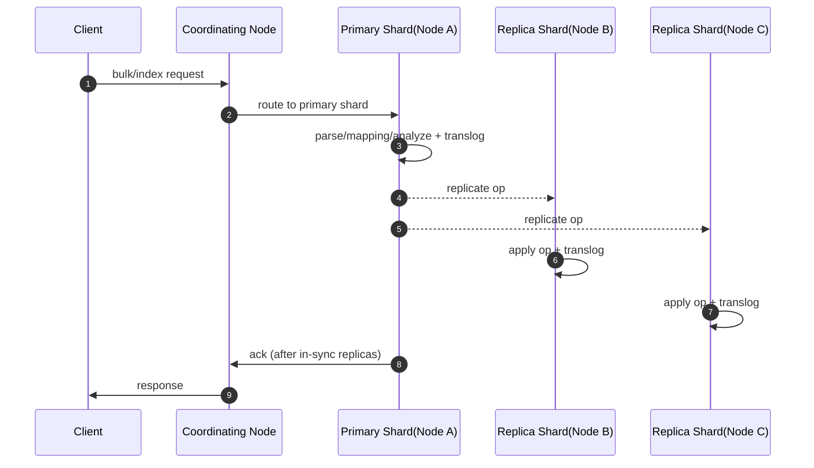
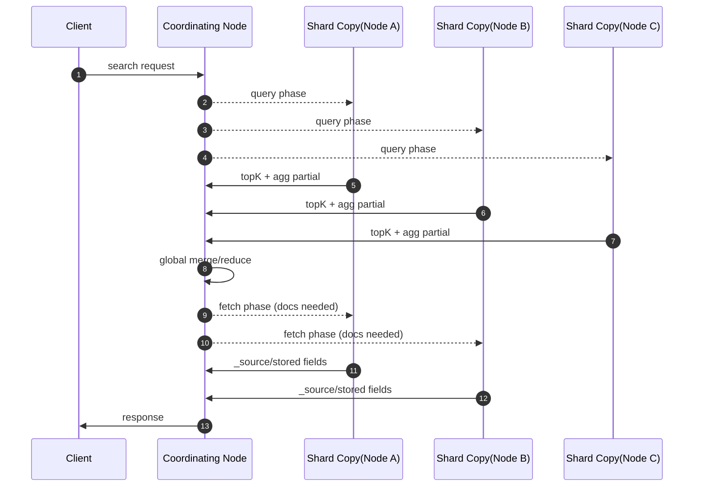
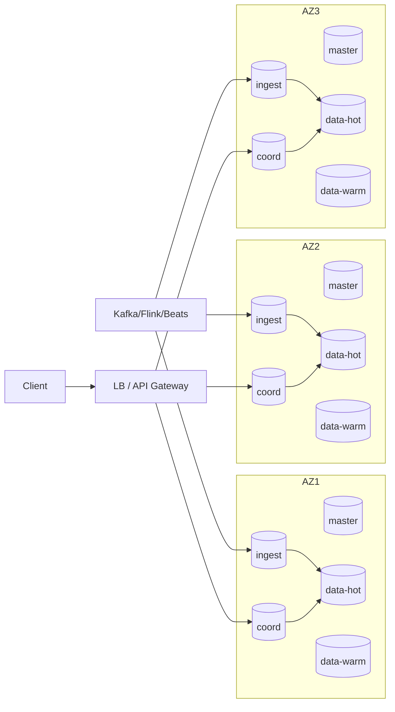

# Elasticsearch 核心原理详解（存储、查询、架构、调优与高可用）

> 适用范围：以 Elasticsearch 7.x/8.x 为主（底层 Lucene 8/9）。不同版本在节点角色、集群协调、参数命名上可能略有差异，但“分片/段/倒排/Doc Values/两阶段搜索/主副本复制”等核心机制基本一致。

## 目录

- [1. 总览：Elasticsearch 在做什么](#1-总览elasticsearch-在做什么)
- [2. 核心抽象与术语](#2-核心抽象与术语)
- [3. 数据是怎么存的（写入链路）](#3-数据是怎么存的写入链路)
- [4. Lucene 索引内部：段、倒排、Doc Values、BKD、_source](#4-lucene-索引内部段倒排doc-valuesbkd_source)
- [5. 近实时（NRT）：refresh / flush / merge](#5-近实时nrtrefresh--flush--merge)
- [6. 数据是怎么查的（查询链路）](#6-数据是怎么查的查询链路)
- [7. 聚合、排序、高亮、脚本：为什么会慢](#7-聚合排序高亮脚本为什么会慢)
- [8. 集群架构与请求如何被处理](#8-集群架构与请求如何被处理)
- [9. 设计优秀的点：工程取舍与收益](#9-设计优秀的点工程取舍与收益)
- [10. 高可用与容灾：怎么保证服务不中断](#10-高可用与容灾怎么保证服务不中断)
- [11. 高并发与性能优化：写入、查询与聚合](#11-高并发与性能优化写入查询与聚合)
- [12. 容量规划与分片策略：少踩坑](#12-容量规划与分片策略少踩坑)
- [13. 观测与排障：用哪些指标定位问题](#13-观测与排障用哪些指标定位问题)
- [14. 生产检查清单（Checklist）](#14-生产检查清单checklist)
- [15. 大厂生产实践：架构、治理、压测、成本与故障处理](#15-大厂生产实践架构治理压测成本与故障处理)

---

## 1. 总览：Elasticsearch 在做什么

Elasticsearch（ES）是一个“分布式的搜索与分析引擎”，它把两件事结合起来：

1. **Lucene 的倒排索引能力**：把文本/结构化数据变成便于检索的索引结构，实现全文检索、相关性排序、过滤、排序、聚合分析等。
2. **分布式系统能力**：把一个逻辑索引拆分成多个分片（Shard）分布到集群节点上，通过复制（Replica）与协调（coordinating/scatter-gather）提供扩展性与高可用。

理解 ES 的关键在于同时掌握：

- **单机 Lucene 如何存/如何查**（段、倒排、Doc Values、BKD、缓存、合并）。
- **ES 如何把 Lucene 变成可横向扩展的集群**（分片路由、主副本复制、两阶段查询、集群状态、故障恢复）。

---

## 2. 核心抽象与术语

### 2.1 逻辑层：Index / Document / Mapping

- **Index（索引）**：逻辑上的数据集合（类似数据库的“表”但不完全等价），包含 mapping、settings、分片等。
- **Document（文档）**：一条 JSON 记录，最终会变成 Lucene 文档（多字段）。
- **Mapping（映射）**：字段类型与索引/存储方式的声明（text/keyword/numeric/date/geo/vector 等），决定：
  - 是否参与倒排（可搜索）
  - 是否有 Doc Values（可排序/聚合）
  - 分词器（Analyzer）与检索分析器（Search Analyzer）
  - 额外结构：`nested`、`join`、`runtime`、`copy_to` 等

### 2.2 分布式层：Shard / Replica / Cluster State

- **Shard（分片）**：ES 的横向扩展单元。一个 Index 会被拆成多个主分片（primary shards）。
  - **每个分片本质上就是一个 Lucene 索引**（位于某个节点的磁盘目录中）。
- **Replica（副本分片）**：主分片的复制，用于高可用与提高查询吞吐（可在副本上查询）。
- **Cluster State（集群状态）**：集群的“元数据与路由表”，包括：
  - 索引/模板/别名、mapping、settings
  - 分片到节点的分配（routing table）
  - 节点列表与角色
  - 其他元信息（如 ILM、组件模板等）

### 2.3 节点角色（常见）

ES 通过节点角色分工（同一节点可承担多个角色）：

- **Master-eligible（主节点候选）**：负责集群元数据与分片调度决策（分配/迁移/恢复等），维护并发布 cluster state。
- **Data 节点**：承载分片、执行索引与查询。
  - 常见数据分层：hot/warm/cold/frozen（主要影响分片分配与硬件配置）。
- **Ingest 节点**：执行 ingest pipeline（如 grok、geoip、脚本处理等）。
- **Coordinating-only（协调节点）**：不存数据，只负责请求编排（scatter/gather）与结果汇总，适合做入口层。

### 2.4 最小例子：一眼看懂“倒排 + Doc Values + Query/Fetch”

很多资料把 ES 讲得很“云”，但你只要看懂下面这个 3 文档例子，后面所有机制都会有抓手。

假设一个索引只有 1 个分片（先忽略分布式），mapping 如下：

- `title`：`text`（会分词，走倒排，用于全文检索）
- `status`：`keyword`（不分词，走倒排 + doc values，用于过滤/聚合/排序）

写入 3 个文档（为了简单把它们当作同一个 segment）：

- doc0：`title="quick brown fox"`, `status="published"`
- doc1：`title="quick fox"`, `status="draft"`
- doc2：`title="brown dog"`, `status="published"`

`title` 字段经分析器（lowercase + whitespace）后得到 tokens：

- doc0：`[quick, brown, fox]`
- doc1：`[quick, fox]`
- doc2：`[brown, dog]`

于是 `title` 的倒排（term → docIDs）大致是：

```text
brown -> [0, 2]
dog   -> [2]
fox   -> [0, 1]
quick -> [0, 1]
```

`status` 字段除了有倒排（用于 `term` 过滤），还会有 doc values（按 docID 取值）：

```text
doc0 -> published
doc1 -> draft
doc2 -> published
```

现在执行一个查询：

- query：`title` 同时包含 `quick` 和 `fox`（AND）
- filter：`status = published`

Query phase 的核心就是“有序列表/位图的交集”：

1. `quick` postings：`[0,1]`
2. `fox` postings：`[0,1]`
3. AND 交集：`[0,1] ∩ [0,1] = [0,1]`
4. `status=published` filter（可缓存成 bitset）：`{0,2}`
5. 最终候选：`[0,1] ∩ {0,2} = [0]`

Fetch phase 才去读 `_source`：

- 只需要把 doc0 的 `_source` 从 stored fields 中取出来并返回（而不是把 3 个文档都读出来）。

> 你可以把 ES 的大部分性能直觉简化成：倒排负责“把候选集缩到很小”，doc values 负责“在小候选集上做排序/聚合/取值”，fetch 负责“只对最终需要的 doc 读 `_source`”。

---

## 3. 数据是怎么存的（写入链路）

这一节以“写入一条文档”为主线，解释从客户端到磁盘发生了什么。

### 3.1 请求入口：coordinating node 与路由

客户端可以把写请求发到任意节点。接收请求的节点会作为 **coordinating node**：

1. **解析请求**（Index/Update/Delete/Bulk）。
2. **确定目标分片（routing）**：
   - 默认：对 `_id` 进行 hash，然后 `hash % primary_shard_count` 得到主分片编号。
   - 如果指定了 `routing`：用 routing 值替代 `_id` 做 hash（常用于“按租户/用户聚簇”，减少查询扇出）。
3. 将写请求转发给目标主分片所在的数据节点。

### 3.2 主分片写入：从 JSON 到 Lucene 文档

主分片收到写入后，大致经历：

1. **解析 JSON → 字段值**
2. **应用 mapping**
   - 如果开启动态映射（dynamic mapping），可能触发 **mapping 更新**（会影响 cluster state，成本高，易导致“mapping 爆炸”）。
3. **分析（Analysis）**（针对 `text` 字段）
   - 字符过滤（char filter）→ 分词器（tokenizer）→ token 过滤（token filter）。
   - 产出 terms（词项）、positions（位置）、offsets（偏移）等，为倒排索引做准备。
4. **写入 Lucene 索引缓冲（Indexing Buffer）**
   - 还未立刻生成可搜索的段（segment），属于内存态（同时可能伴随一些结构的构建）。
5. **记录 translog（事务日志）**
   - translog 是 ES 层的“写前日志（WAL）”，用于崩溃恢复与副本追赶。
   - 依据 `index.translog.durability` 决定是否每次请求都 fsync：
     - `request`：每次请求都落盘并 fsync（更安全，吞吐较低）
     - `async`：定期 fsync（吞吐更高，可能丢失极短时间窗口的数据）

### 3.3 复制与确认：primary → replica

ES 的写入复制模型可以理解为“以主分片为序列化点的同步复制”：

1. **主分片执行写入**（包含 translog 记录等）。
2. **主分片并行把操作转发到每个 replica 分片**。
3. replica 执行相同的写操作（基于操作日志与序列号，而不是文件级复制）。
4. **ACK 的关键是 in-sync replicas 集合**：
   - primary 会把操作同步复制到“当前 in-sync 的 replica”。
   - 当所有 in-sync replicas 都确认成功（或失败的副本被判定为 stale 并移出 in-sync 集合）后，primary 才会对客户端 ACK。
   - 直觉：**被 ACK 的写入，至少在“可被提升为 primary 的那些副本”上是完整一致的**。
5. **`wait_for_active_shards` 控制的是“开始执行之前需要多少个 active shard copies”**：
   - 若达不到要求，请求会等待或失败（从而拉高写入延迟，但降低“只有主分片单点承载”的窗口）。
   - `wait_for_active_shards=1`：只要求 primary active（常见默认）。
   - `all` 或更高：要求更多副本也 active 后才开始执行，适合更强容灾要求但会更慢。

### 3.4 一致性与并发控制：seq_no / primary_term / 乐观锁

ES 在写入一致性上依赖几个核心机制（尤其在故障与主副切换时）：

- **`_seq_no`（序列号）**：每个分片内单调递增，标识操作顺序。
- **`_primary_term`（主任期）**：主分片每次发生主副切换（primary 变更）会递增，用于区分不同“领导者时期”的操作。
- **CAS/乐观并发控制**：
  - `if_seq_no` + `if_primary_term`：防止并发更新覆盖（典型“更新前先读到版本”场景）。

### 3.5 Update/Delete 的本质

在 Lucene 里段（segment）是不可变的，因此：

- **Delete**：写入一个“删除标记”（tombstone/软删除），真正回收在后续 segment merge 时发生。
- **Update**：通常等价于 “Delete 旧文档 + Index 新文档”。

因此高频 update/delete 会增加：

- 段合并压力（merge）
- 删除比例上升导致查询扫描开销上升
- translog 与版本映射（version map）压力

### 3.6 Durability、Checkpoint 与历史保留（更深入一层）

上面描述了“写入成功”这件事，但在分布式系统里还需要回答三个更深的问题：

1. **写入到底持久化到什么程度才算成功？**
2. **主副切换时，哪些操作算“安全可见”？**
3. **副本/CCR/恢复追赶时，历史操作要保留多久？**

ES/Lucene 组合的关键点：

- **Lucene commit（flush）** 才会形成“持久化的索引提交点（commit point）”。
- **translog** 保障“commit 之前发生崩溃”仍可通过重放恢复到最近写入状态。
- **sequence number / primary term** 让故障切换后的历史收敛到一致顺序。

在分片副本一致性上，常会提到两个 checkpoint（概念解释）：

- **Local checkpoint（本地检查点）**：某个 shard copy（primary 或 replica）已经处理到的最大 `_seq_no`。
- **Global checkpoint（全局检查点）**：已被“所有 in-sync shard copies”确认并持久化到足够安全程度的最大 `_seq_no`。
  - 直觉：`<= global checkpoint` 的操作在故障切换后不会丢（对系统来说是“安全历史”）。

为了让副本与追赶者能正确补齐历史，ES 还会通过 **soft deletes + retention leases** 保留一定窗口的操作历史：

- soft deletes：在段里保留被删除/更新的历史痕迹（而不是立刻物理清理），便于追赶。
- retention lease：告诉 primary “某个追赶者（副本、CCR follower、恢复过程）需要从哪个 seq_no 开始的历史”，防止 merge 过早清掉它还没追上的历史。

> 工程含义：这套机制让 ES 可以在“操作级复制 + 段合并”的世界里，仍然实现可恢复、可追赶、可收敛的一致性复制。

### 3.7 Bulk 写入在集群中的拆分与合并

Bulk API 是写入吞吐的核心手段，但它并不是“服务器端一次性写入一个索引文件”，而是：

1. **coordinating node 按目标分片把 bulk items 分组**（同一 shard 的操作聚成一批）。
2. 并行把每组发往对应的 primary shard。
3. 每个 primary shard 按“单条写入”的逻辑执行（解析、mapping、分析、translog、复制）。
4. coordinating node 汇总每个 item 的结果，bulk 响应里可能“部分成功、部分失败”。

常见失败类型与处理建议：

- 429（队列满/写入压力）：客户端要做 **指数退避重试**，并降低并发/批大小。
- mapping 冲突：属于数据质量/契约问题，重试无意义，应隔离与修复数据。
- 单条过大（超过 http/transport 限制）：需要在客户端拆分或调整上游数据模型。

### 3.8 Shard 的三份“持久化数据”：`index/`、`translog/`、`_state/`

很多人理解 ES 只停留在“数据写进了索引”，但落盘层面其实是“三件套”：

1. **`index/`：Lucene 索引文件（segments/倒排/doc values/...）**
   - 这是最终的“可搜索数据结构”，写入通过 refresh 生成新 segment，通过 flush/commit 形成新的提交点（`segments_N`）。
2. **`translog/`：ES 的写前日志（WAL）**
   - 用于：崩溃恢复（把“尚未 flush 到 Lucene commit 的操作”重放回来）、副本追赶（在一定机制下）。
3. **`_state/`：分片/索引状态快照**
   - 存放分片级元数据、状态信息等，帮助节点重启后快速恢复一致视图（具体文件名随版本变化）。

> 直觉：`index/` 是“最终索引”，`translog/` 是“最近增量日志”，`_state/` 是“恢复与一致性的元数据”。

### 3.9 translog 到底是什么格式？为什么它能恢复“刚写入但没 commit 的数据”

translog 的核心设计目标是两点：

1. **追加写（append-only）**：顺序写入吞吐高、对磁盘友好。
2. **可校验可截断**：崩溃后可能出现“写到一半”的尾巴，需要通过校验与 checkpoint 安全截断。

你可以把它想象成一个“带校验的操作日志文件”，概念结构类似：

```text
translog generation file:
  Header(版本、UUID 等)
  Record #1: length + op_bytes + checksum
  Record #2: length + op_bytes + checksum
  ...

checkpoint file:
  current generation + last synced offset + (其他校验信息)
```

写入时发生什么：

- primary 在把操作写入 Lucene 内存结构的同时，会把同一操作序列化后追加到 translog。
- 当 durability 策略要求 fsync 时，会把 translog 刷到磁盘（保证进程崩溃后仍可恢复）。

崩溃恢复时发生什么（本地恢复的直觉流程）：

1. 先打开 Lucene 的最后提交点（读 `segments_N`）得到一个一致的“基线索引视图”。
2. 再读取 checkpoint，找到 translog 已确认的安全 offset。
3. 从 translog 里把 commit 之后的操作按顺序重放（replay），把索引补齐到崩溃前的状态。

为什么“写入成功但 search 查不到”有时还能 GET 到？

- GET（realtime）可以从 translog/内存结构读到最新写入。
- search（NRT）只读 refresh 后的 segment 视图（见 5.4）。

flush 与 translog 的关系（为什么 flush 能降低恢复时间）：

- flush 会产生新的 Lucene commit point，意味着“更多写入已经进入 `index/` 的基线”。
- 因此恢复时需要重放的 translog 变短（replay 成本更低）。

---

## 4. Lucene 索引内部：段、倒排、Doc Values、BKD、_source

理解这一节，基本就理解了“ES 为什么能快”，以及“为什么某些查询/聚合会慢”。

### 4.1 一个分片 = 一个 Lucene Index = 多个 Segment

Lucene 索引由多个 **segment** 组成：

- segment 是 **不可变** 的小索引单元（写入后只读）。
- 新写入先在内存 buffer，refresh 后会产生新的 segment。
- 删除与更新通过“删除标记”实现，直到 merge 才物理回收。

不可变带来的好处：

- 查询几乎无锁（读写隔离，写入只产生新 segment）
- OS Page Cache + mmap 友好
- 合并（merge）可在后台进行，不阻塞查询（但会消耗 IO/CPU）

### 4.2 倒排索引（Inverted Index）：全文检索的核心

对 `text`（或 `keyword`）字段，Lucene 主要构建倒排：

- **Term Dictionary（词典）**：保存所有词项（term），常用 FST（有限状态转移机）压缩存储，支持快速前缀/模糊匹配等。
- **Postings List（倒排表）**：每个 term 对应一组文档列表（docIDs），并可包含：
  - term frequency（TF）
  - positions（词位置，用于短语查询、邻近查询）
  - offsets（字符偏移，用于高亮）
  - skip data（跳表/分块，加速跳跃）

倒排使得“包含某个词”的查询从 O(N) 扫描变成近似 O(匹配文档数)。

如果你想“真正理解倒排”，建议把它当作两层结构：

1. **词典层（term → postings 的位置）**：给定一个 term，能快速定位它的倒排表在哪里。
2. **倒排层（postings）**：给定一个 term，能快速枚举包含它的 docIDs（以及位置/频次等）。

下面把这两层拆开讲清楚。

#### 4.2.1 词典层：BlockTree + FST（为什么前缀/模糊能快）

Lucene 的词典并不是把所有 term 原样放在内存里，而是典型的“磁盘顺序结构 + 内存索引”组合：

- **磁盘上**：term 按字典序存储，并做前缀压缩/分块（block）。
- **内存里**：用 **FST（Finite State Transducer，有限状态转移机/转导器）** 存一份“从 term 前缀到磁盘块位置”的索引。

直觉理解 FST：

- 把“很多字符串”插入到一棵 trie（前缀树）里会共享前缀，但 trie 指针多、空间大。
- FST 是把 trie 进一步 **最小化 + 压缩** 的结构：共享前缀，也共享相同后缀子结构（最小化 DFA 的思想），同时还能在边上携带“输出”（比如文件指针/ordinal 的增量）。

因此：

- **term 查找**：沿着 FST 按字节走一遍就能定位到某个 block，再在 block 内做小范围查找。
- **前缀查询（prefix）**：在 FST 上走到前缀节点后，可以遍历其子图快速定位大量 term。
- **模糊查询（fuzzy）**：会在 automaton（编辑距离自动机）与 FST 之间做交集遍历，本质也是“自动机在图上走”，比全量扫描词典要高效得多（但仍可能很贵）。

> 这也是为什么“term 数量巨大（高基数）”会让词典变大：FST 再压缩也需要存“可区分路径”。

#### 4.2.2 倒排层：postings 的核心约束（有序、块、压缩、可跳跃）

倒排表里最关键的事实只有一个：**docID 是递增的**。

有了“递增 docID”，Lucene 才能做到：

- 用 **差分编码（d-gap）** 存 docID：只存相邻 docID 的差值（通常是小整数）。
- 用 **块压缩（block packed / SIMD）** 存一段 docID：例如把 N 个 d-gap 按固定 bit-width 打包，既省空间又利于 CPU 向量化解码。
- 用 **跳跃（skip）/分块最大值** 加速 `advance(target)`：能快速跳过一大段 docID，而不是一条条 next。

把 postings 看成一个迭代器接口会更贴近执行模型：

- `nextDoc()`：返回下一个匹配 docID
- `advance(target)`：跳到 `>= target` 的第一个匹配 docID（靠 skip/块索引加速）

这两个操作是后面布尔查询（AND/OR）和 TopK 收集的基础。

#### 4.2.3 positions / offsets：短语查询与高亮为何更贵

postings 可分为“轻”和“重”两类：

- **只存 docID（doc-only）**：适合纯过滤（keyword 过滤、某些结构化字段），空间小、遍历快。
- **存 docID + freq + positions（以及 offsets）**：支持短语、邻近、高亮，但：
  - 每个 doc 里 positions 数可能很多
  - positions 同样用差分压缩，但解码与校验更费 CPU

所以短语查询（phrase）常见流程是：

1. 先用倒排把“包含所有词”的 docID 交集找出来（候选集）。
2. 再对候选 doc 读取 positions，做“位置对齐”校验是否满足短语/距离约束。

#### 4.2.4 docID 是什么：为什么同一个 `_id` 查起来像 O(1)

Lucene 内部的 docID 是一个 **段内递增的整型编号**：

- 每个 segment 的 docID 从 0 开始。
- 搜索时会把每个 segment 的 docID 加上一个 base（段起始偏移）组成“全局视角”的 docID。

这带来两个重要结果：

- postings 里存的是“段内 docID”，非常紧凑。
- 但是 `_id` 并不是 docID，ES 的 `_id` 查询通常会走一个额外的“term 查询”（`_id` 本质是一个倒排字段），再定位到 docID 做 fetch。

#### 4.2.5 倒排是怎么“构建出来”的（从 token 到 postings）

写入时，Lucene 对每个字段大致做：

1. Analyzer 把文本变成 token 流（term、position、offset）。
2. 把 token 按 term 归并到内存结构（类似 term → postings builder）。
3. flush/refresh 时把这些结构写成一个新的 segment：
   - term 字典写成有序块 + FST 索引
   - postings 写成压缩块 + skip 信息

因此“写入越快 ≠ 查询越快”：

- 写入快会产生更多小 segment
- 小 segment 会让查询要合并更多迭代器/更多段
- 最终要靠 merge 把小段合成大段，稳定查询性能

### 4.3 Doc Values：排序与聚合的核心（列式存储）

倒排适合“从 term 找 doc”，但聚合/排序常需要“从 doc 找字段值”。这时依赖 **Doc Values**：

- Doc Values 是按列存储（columnar），每个字段单独存。
- 用于：
  - `sort`（排序）
  - `aggregations`（桶/指标聚合）
  - `script` 读取字段值（通常走 doc values 更快）
- 对 `keyword/numeric/date/geo_point` 等字段，默认启用 doc values。
- 对 `text` 字段通常不启用 doc values（因为分词后值不适合列式），若强行对 `text` 做聚合/排序，往往会触发 fielddata（昂贵且吃堆内内存）。

Doc Values 更深入地看，可以理解为“为了高效扫描/随机取值而设计的磁盘列式编码”：

#### 4.3.1 数值型 Doc Values：PackedInts（位打包）与块解码

对 numeric/date 这类单值字段，常见编码思路是：

- 先把某个段里该字段的所有值按 docID 顺序组成数组 `v[docID]`。
- 利用值域特性做压缩：
  - delta（减去最小值）
  - GCD 压缩（如果值都能被某个公因数整除）
  - **bit packing（位打包）**：用最少的 bit 宽度存储一批值

读取时往往以块为单位解码（例如一次解出 128/256 个值），非常适合聚合/排序时的顺序扫描。

#### 4.3.2 keyword 的 Doc Values：字典 + ordinal（为什么 terms 聚合要先建全局序号）

对 `keyword` 这类字符串字段，直接存字符串会非常慢，因此 Lucene 通常用两层结构：

1. **字典（dictionary）**：该段里所有唯一值的有序列表（value → ord）。
2. **按 docID 存 ord（doc → ord 或 doc → ord list）**：
   - 单值字段：每个 doc 存一个 ord
   - 多值字段：每个 doc 存一个 ord 列表（通过“地址表 + ords 数组”实现）

为什么 terms 聚合会强调 **global ordinals**？

- 每个 segment 的字典是独立的：同一个字符串在不同段里 ord 可能不同。
- 聚合要跨段统计，如果直接用字符串做 key，会产生大量字符串比较与内存分配。
- 所以 ES 会把各段字典“合并”成一个 **全局字典**，并为每段建立 `segmentOrd -> globalOrd` 的映射，从而让统计用整数 key 完成（更快、更省内存）。

#### 4.3.3 fielddata 为什么危险：uninvert（把倒排“翻回来”）

当你对 `text` 字段做聚合/排序时，ES 可能会启用 fielddata：

- fielddata 的本质是对倒排做 **uninvert**：把“term → doc”翻成“doc → term(s)”并放到堆内内存。
- 由于 `text` 是分词字段，term 数往往巨大，doc → terms 的结构会非常大，容易把 heap 顶爆并触发长 GC。

因此最佳实践是：

- 聚合/排序用 `keyword`（doc values）
- 全文检索用 `text`（倒排）
- 需要两者时用 multi-fields：`field` 为 `text`，`field.keyword` 为 `keyword`

### 4.4 BKD / Points：数值、范围、地理的“树结构索引”

对于 numeric/date/geo_shape 等，Lucene 使用 **BKD Tree（Block KD-tree）** 或 Points 索引结构：

- 适合范围查询（range）、点查询（term on numeric）、地理空间（geo）过滤等。
- 相比把数值转成字符串走倒排，BKD 对范围裁剪更高效。

BKD 可以把它理解为“面向多维点数据的块状 KD-tree”，核心目标是：**让范围查询能大量剪枝**。

#### 4.4.1 BKD 的构建：排序 + 递归切分 + 叶子块

以 1 维数值字段为例，每个文档会贡献一个点（value, docID）。BKD 构建过程（概念化）：

1. 收集所有点。
2. 按 value 排序。
3. 以中位数切分成左右两半（保证树尽量平衡）。
4. 递归直到叶子节点，叶子里存一块点（block），块大小通常是固定上限（例如 1024 点，具体实现细节随版本变化）。
5. 每个节点保存其覆盖范围（min/max），用于查询时剪枝。

多维（如 geo_point 的 2 维，经纬度）时，会在不同维度之间选择切分维度（类似 KD-tree 的轮换/启发式选择），节点保存的是“多维包围盒”（bounding box）。

#### 4.4.2 BKD 的查询：访问相交节点，跳过不相交节点

范围查询（例如 `10 <= x <= 20`）时：

- 从根节点开始，如果节点的 `[min,max]` 与查询区间不相交 → **整棵子树跳过**。
- 如果相交：
  - 若是内部节点：递归访问子节点
  - 若是叶子块：扫描块内点，筛出落在范围内的 docIDs（必要时再与其他条件做交集）

因此复杂度接近：

- `O(访问节点数 + 命中点数)`，而不是 `O(全量点数)`

#### 4.4.3 BKD vs Doc Values：一个用于“过滤”，一个用于“取值”

对 numeric/date 字段通常同时存在：

- BKD（Points）：用于 `range`/`term` 这类过滤与点查询（快速剪枝）。
- Doc Values：用于排序/聚合时按 docID 扫描取值（列式高吞吐）。

这也解释了一个现象：

- 同样是 numeric 字段，“过滤很快”但“排序/聚合仍可能慢”，因为它们走的是不同的数据路径。

### 4.5 Stored Fields 与 `_source`

ES 常见返回内容来自两类：

- **`_source`**：原始 JSON 文档（通常压缩后存储），用于 fetch 阶段返回整文档、reindex、update by query 等。
  - 好处：恢复与回放简单；缺点：占用磁盘与 IO。
- **Stored fields**：Lucene 的“存储字段”，可仅存需要返回的字段（ES 里 `_source` 更常用）。

实践建议：

- 若业务不需要返回整文档，可考虑禁用 `_source` 或用 `stored_fields`/`docvalue_fields` 替代，但会影响很多功能（更新、重建、调试），需要谨慎评估。

### 4.6 向量检索（kNN / ANN）的存储与查询（可选理解）

在 ES 8.x 里向量检索常见两种：

- **dense_vector + HNSW（近似最近邻）**：用于语义检索，牺牲精确性换速度。
- **精确向量计算（script_score）**：更慢但可控。

其本质也遵循“segment 不可变 + 后台构建图/结构”的思路，只是数据结构从倒排/DocValues/BKD 扩展到了 ANN 图结构。

### 4.7 数据到底怎么落盘：Lucene 的 Index 目录、`segments_N` 与文件格式

你问的“数据到底以什么方式存储”，在 ES 里可以翻译成一句话：

- **每个 shard = 一个 Lucene Index；Lucene Index = 一组 `segments`；每个 segment = 一堆按功能拆分的文件。**

这部分看起来枯燥，但它能让你一眼看懂：

- 为什么 `_source` 大会拖慢查询（因为 fetch 会狂读 stored fields）
- 为什么 terms 聚合会打爆内存/CPU（因为读 doc values + global ordinals + reduce）
- 为什么 range 查询不走倒排也很快（因为走 BKD/Points）

> 说明：Lucene 的“扩展名/文件拆分”会随版本与 codec 演进。下文以 Lucene 9.x 的默认 codec 体系做讲解（你会看到 `lucene90/lucene94/lucene99` 等格式并存），并在容易混淆处标注“不同版本可能不同”。

#### 4.7.1 一个 shard 在磁盘上的“真实样子”

在数据节点上，一个 shard 的物理目录通常可以理解为三块（路径名随版本/发行版略有差异，结构含义一致）：

```text
<data-path>/nodes/0/indices/<indexUUID>/<shardId>/
  index/        # Lucene index：segments_N + segment files
  translog/     # ES translog：WAL，用于崩溃恢复与追赶
  _state/       # shard/index 元数据快照（用于快速恢复/一致性）
```

其中 `index/` 目录里就是 Lucene 的世界：`segments_N`（提交点）+ `_<seg>.xxx`（各种 segment 文件）。

#### 4.7.2 `segments_N`：Lucene 的 commit point（“这次提交由哪些段组成”）

Lucene 的提交点文件名形如 `segments_N`（N 是 generation）：

- 同一目录下可能同时存在多个 `segments_N`（旧提交点暂时无法删除、或自定义删除策略等原因）。
- **generation 最大的 `segments_N` 是当前生效的提交点**。
- 它记录了：每个 segment 的名字、ID、使用的 codec、删除 generation、删除数、fieldInfos/docValues 的 generation、更新文件列表、commit user data 等。

直觉上：

- **`segments_N` 就是“这份 Lucene 索引在磁盘上的一致性快照索引”**。
- 打开一个 IndexReader 时，本质就是读取 `segments_N`，再把其中列出的 segment 文件打开。

这也解释了“为什么 refresh 不等于持久化”：

- refresh 可能只是生成新 segment 并让 searcher 可见，但不一定产生新的 `segments_N` 提交点（取决于 flush/commit）。

#### 4.7.3 segment 文件清单（以 Lucene 9.x 为例）：“哪个能力对应哪些文件”

下面这张表把“能力/数据结构/文件”一一对应起来（最适合用来排障与做容量/IO 预估）：

| 类别 | 常见扩展名（示例） | 作用（你可以把它当作“存的是什么”） | 典型被谁读 |
|---|---|---|---|
| Commit | `segments_N` | 当前提交点：有哪些 segment、各自的 gen/codec/更新信息 | 打开索引、恢复 |
| Segment 元信息 | `.si` | segment 级元数据：是否 compound、文件清单、属性、index sort 等 | 打开索引 |
| FieldInfos | `.fnm` | 字段清单与字段能力位（doc values 类型、points 维度等） | 打开索引、查询初始化 |
| Term Dictionary | `.tim` | 按字典序存 term + per-term stats + 指向 postings 的指针 | term 查询、match/rewrite |
| Term Metadata | `.tmd` | term 元数据/字段级统计（以及索引元数据） | term 查询、打开字段 |
| Term Index | `.tip` | 每字段一个 FST：prefix → `.tim` 的 block 指针（加速 seek/避免无效 seek） | term seek、前缀/模糊相关 |
| Postings（doc/freq/skip） | `.doc` | docIDs + freq + skip data（加速 `advance(target)`） | 过滤、评分候选枚举 |
| Postings（positions） | `.pos` | positions（短语/邻近校验用） | phrase/span/interval |
| Postings（payload/offset） | `.pay` | payloads + offsets（高亮/offset 相关） | 高亮、offset 依赖查询 |
| Stored fields（数据） | `.fdt` | 存储字段数据（包括 `_source`），按 chunk 压缩（常见 LZ4），块大小通常 ≥16KB | fetch `_source` |
| Stored fields（索引） | `.fdx` | 两个单调数组：doc block 的 docID 与磁盘 offset（用于二分定位 chunk） | fetch `_source` |
| Stored fields（元） | `.fdm` | `.fdx` 单调数组的元数据 | fetch `_source` |
| Doc Values（数据/元） | `.dvd` / `.dvm` | 列式存储（numeric/binary/sorted/sorted_set/sorted_numeric）及其编码元数据 | 排序、聚合、脚本取值 |
| Norms（数据/元） | `.nvd` / `.nvm` | 评分归一化（常见每 doc 1 byte 或压缩表示）及元数据 | BM25 等评分 |
| Live Docs | `.liv` | 删除位图（segment 有删除时才存在） | 查询时跳过已删 doc |
| Points/BKD | `.kdd`/`.kdi`/`.kdm` | BKD 树：叶子数据/内部节点/字段元数据（不同版本可能叫 `.dim/.dii`） | range/geo 过滤 |
| Term Vectors | `.tvd`/`.tvx`/`.tvm` | term vectors 数据/索引/元数据（用于高亮/向量功能） | term vectors / 特定高亮 |
| 向量检索（kNN） | `.vec`/`.vemf`、`.vex`/`.vem` | 向量值（flat）+ 元数据，以及 HNSW 图索引 + 元数据 | ANN 检索 |
| Compound | `.cfs`/`.cfe` | 把一个 segment 的多个文件打包成“虚拟单文件”（降低文件句柄压力） | 打开索引/读取 |

你会发现：**Lucene 把“不同访问模式”拆成不同文件**，目的是让 IO 更可预测：

- 全文检索主要扫倒排（`.tim/.tip/.tmd` + `.doc/.pos/.pay`）
- 聚合/排序主要扫 doc values（`.dvd/.dvm`）
- 返回 `_source` 主要扫 stored fields（`.fdt/.fdx/.fdm`）
- range/geo 过滤主要走 BKD（`.kdd/.kdi/.kdm`）

#### 4.7.4 `_source` 到底存在哪里？压缩怎么做？

ES 的 `_source` 本质是 Lucene 的 stored field（存储字段）的一部分：

- **数据在 `.fdt`**：按“文档块（chunk）”压缩存储（Lucene 9.x 常见是 LZ4；块通常 ≥16KB）。
- **索引在 `.fdx`**：存 doc block 的 docID 与 offset，用于二分查找定位“包含某个 doc 的压缩块”。
- **元数据在 `.fdm`**：描述 `.fdx` 的单调数组等信息。

所以 fetch 阶段的性能规律很直观：

- 只要你返回 `_source`，就一定会读 `.fdt`（哪怕 query phase 很快）。
- `_source` 越大、命中 topK 越多、磁盘 cache 越冷 → fetch 越慢。

#### 4.7.5 Doc Values 的磁盘编码：为什么它适合聚合/排序

Doc Values 是“按 docID 顺序”的列式结构（`.dvd` 数据 + `.dvm` 元信息），并会按数据分布选择不同编码策略（典型策略的直觉）：

- **delta/GCD 压缩**：数值相近或有公因数的 numeric，用更少 bit 存储。
- **monotonic 压缩**：单调递增的地址/offset（例如多值字段的地址表），存“偏离期望增量”的 bitpacked 块。
- **字典 + ordinals**：`keyword`/sorted 类字段用字典编码，doc 里只存 ord（整数），聚合用整数桶更快。
- **前缀压缩 binary**：字符串/bytes 在块内共享前缀，减少重复存储。

这也是为什么：

- 聚合/排序字段要用 `keyword/numeric/date`（走 doc values，几乎不占 heap）
- 对 `text` 做聚合会触发 fielddata（把倒排 uninvert 到 heap，风险极高）

#### 4.7.6 postings 的拆分：为什么 phrase/highlight 更贵

postings 被拆成：

- `.doc`：docIDs + freq + skip（用于快速枚举与跳跃）
- `.pos`：positions（短语/邻近校验）
- `.pay`：payload + offsets（高亮/offset）

因此：

- 纯过滤/term 查询通常主要触碰 `.doc`（很快）
- phrase/span/高亮会额外触碰 `.pos/.pay`（解码更多数据，CPU/IO 更高）

#### 4.7.7 “一眼定位 IO 热点”：请求类型 ↔ 主要文件

这张对照表在生产排障非常好用：

- `match/term/bool.filter`：`.tim/.tip/.tmd` + `.doc`（命中少时非常快）
- `phrase/interval/span`：额外读 `.pos`（positions 对齐）
- `highlight`：额外读 `.pay`（offset）和/或 term vectors（`.tvd/.tvx/.tvm`）
- `sort/terms agg`：主要读 `.dvd/.dvm`（doc values 扫描 + ordinals）
- `range/geo`：主要读 `.kdi/.kdd/.kdm`（BKD 剪枝）
- 返回 `_source`：主要读 `.fdt/.fdx/.fdm`

为什么理解这些有价值？

- **容量**：倒排/DocValues/`_source` 谁更大，决定你该改 mapping 还是改 `_source` 策略。
- **IO**：聚合/排序是“列式扫描 IO”；全文检索是“倒排跳跃 IO”；fetch 是“压缩块读取 IO”。
- **内存**：Lucene 依赖 OS page cache + mmap（heap 再大也替代不了足够的文件缓存）；fielddata 是少数会把数据搬进 heap 的危险路径。

---

## 5. 近实时（NRT）：refresh / flush / merge

ES 被称为 Near Real-Time（近实时）搜索：写入后通常 1 秒左右可被搜索到（默认 refresh interval）。

### 5.1 refresh：让新文档“可搜索”

- refresh 会把内存中的索引缓冲内容写成新的 Lucene segment，并打开一个新的 searcher。
- refresh **不等于 fsync/commit**：它让数据可见，但不保证“进程崩溃后一定不丢”。
- `index.refresh_interval` 决定自动 refresh 周期：
  - 更短：写入更快可见，但产生更多小 segment（merge 压力大）
  - 更长：写入吞吐更高，但可见性延迟更大

更底层地看，refresh 不是一个“魔法按钮”，它对应 Lucene NRT（Near Real-Time Reader）的典型流程：

1. **把 IndexWriter 的内存结构 flush 成新的 segment 文件**（写到文件系统缓存即可，未必 fsync）。
2. **reopen searcher**：打开一个新的 `IndexSearcher/DirectoryReader` 视图，让后续查询能看到新 segment。

这个设计是“段不可变”体系的关键：

- 旧查询仍然使用旧 searcher（旧 segment 视图），不会被正在发生的 refresh 干扰。
- 新查询使用新 searcher，看到更多 segment（可见性推进）。

refresh 的性能代价主要来自：

- 产生更多小 segment → 查询时需要合并更多段的结果，且后续 merge 压力更大。
- 需要为新 segment 构建读侧结构（打开文件、建立部分索引结构、可能触发 warming）。
- request cache 往往会因 refresh 而失效（因为结果依赖 segment 视图），写多读多的场景缓存收益会下降。

### 5.2 flush：Lucene commit + translog 滚动

flush 一般包含：

- 触发 Lucene commit（生成 commit point）
- translog roll（切换到新的 translog 文件）
- 便于恢复时缩短 replay translog 的成本

### 5.3 merge：把多个小 segment 合并成大 segment

merge 是 Lucene 性能与空间管理的核心后台任务：

好处：

- 减少 segment 数量 → 降低查询时需要合并的开销
- 物理清理被删除的文档（tombstone）
- 改善压缩与缓存局部性

代价：

- 高 CPU + 高 IO（读多个旧段，写新段）
- merge 高峰可能拉高查询延迟（尤其在 IO 紧张时）

常见策略：

- 默认 TieredMergePolicy：分层选择 segment 合并。
- **Force merge**：强制合并到较少段，常用于只读历史索引（如按天归档），不建议对热写入索引频繁使用。

#### 5.3.1 TieredMergePolicy（分层合并）的直觉：控制“段预算”

你可以把 TieredMergePolicy 想成在解决一个约束优化问题：

- 目标：让 segment 数量不要太多（否则查询慢），也不要频繁合并（否则写入慢）。
- 约束：合并必须“重写数据”（读旧段写新段），成本与合并字节数近似成正比。

它的典型策略是：

- 按 segment 大小划分层级（tier），每层允许一定数量的段（budget）。
- 当某层段数超预算时，从这一层挑选一组合并候选：
  - 倾向于把相近大小的段合并（避免“一个超大段 + 一堆小段”导致反复重写大段）
  - 会考虑删除比例（delete/soft delete 多的段更值得合并以回收空间）
- 生成一个更大的新段后，进入更高一层，如此逐步“从小到大”。

这也是为什么“refresh 太频繁 → 小段太多”会触发合并雪崩：小段把低层的段预算挤爆了。

#### 5.3.2 merge 的写放大（Write Amplification）：写入吞吐的隐形天花板

因为合并会反复重写旧数据，所以磁盘写入量通常远大于“你实际新增的数据量”。

一个粗略但很有用的心智模型：

- 如果段大小按某个倍率（merge factor）逐级变大，那么每条文档在生命周期里会被重写 `O(log)` 次。
- refresh 产生的初始段越小、删除更新越频繁、合并倍率越低 → 写放大越高。

工程含义：

- 你看到的“写入 TPS 降低”，很多时候不是因为写入逻辑变慢，而是 **merge 在后台吃掉了 IO 带宽**。
- 提升写入吞吐的本质手段之一，就是让系统“少产生小段、少做无谓重写”。

#### 5.3.3 删除、软删除与 merge：为什么 update/delete 多会拖慢一切

由于 delete/update 是标记删除，直到 merge 才物理清理，所以：

- 删除比例高时：
  - 查询要跳过更多 deleted docs（额外判断）
  - 段内有效数据密度下降，压缩与缓存局部性变差
  - merge 更频繁（需要回收空间），写放大进一步上升

如果再叠加 soft deletes（为了复制追赶保留历史），在追赶窗口内 merge 还不能随意清理历史，这会进一步增加空间与 IO 压力（但换来恢复/CCR 的正确性与效率）。

#### 5.3.4 merge 与延迟抖动：为什么 IO 打满时“尾延迟”会先崩

merge 是典型的“持续大 IO + 大写入”后台任务，它和查询/写入共享磁盘与 page cache：

- merge 高峰会抢占磁盘带宽 → fetch 读 `_source`、doc values 读列式会变慢。
- merge 写入新段会污染 page cache → 热查询的缓存页可能被挤掉，导致更多缺页与随机 IO。

因此生产调优经常不是“把 merge 关掉”，而是：

- 让 merge 更平滑（减少小段、避免突刺）
- 给磁盘更高的吞吐与更低延迟（SSD/NVMe）
- 在冷热分层上把 merge 压力与在线查询隔离开

### 5.4 实时 GET（realtime）与 Search（NRT）的可见性差异

一个非常常见的误解是：“我写入成功了，为什么 search 查不到？”

原因在于 ES 同时提供两种不同的读语义：

- **GET by `_id`（实时，realtime）**：
  - 默认 `realtime=true`。
  - 可以直接从 shard copy 的 **版本映射/内存结构 + translog** 读取到“刚写入但尚未 refresh”的文档。
  - 适合写后立刻按 ID 读取/校验/幂等检查等场景。
- **Search（近实时，NRT）**：
  - 只会从“当前打开的 searcher 视图”读取（本质是已 refresh 可见的 segment 视图）。
  - 因此写入后要等到下一次 refresh 才能被搜索到。

如果业务需要“写后可搜”（read-after-write search），常用手段是写入时带：

- `refresh=wait_for`：等待下一次自动 refresh 让本次写入变为可搜索（通常比 `refresh=true` 更稳）。
- `refresh=true`：强制立刻 refresh（代价高，会制造更多小段，降低写入吞吐）。

---

## 6. 数据是怎么查的（查询链路）

把一次 search 请求拆开看，本质是“协调节点编排 + 每个分片本地 Lucene 查询 + 两阶段返回”。

### 6.1 查询入口：coordinating node（协调节点）

任意节点接到查询请求后会成为 coordinating node，主要职责：

1. 解析 DSL、校验索引与参数。
2. 根据 cluster state 得到目标分片列表（primary/replica 都可）。
3. 选择每个分片的具体副本（副本选择策略，如自适应副本选择）。
4. 并行发起 shard-level 请求（scatter）。
5. 汇总每个分片返回的 topK、聚合中间结果等（gather/reduce）。
6. 需要时发起第二阶段 fetch 请求，拿到 `_source`/stored fields（fetch phase）。

### 6.2 扇出（fan-out）与路由（routing）的影响

一个查询要访问多少分片，往往决定了它的下限开销：

- 如果一个 index 有 20 个主分片，即使每个分片很快，协调节点也要：
  - 发送 20 个子请求
  - 等 20 个结果
  - 做 20 路 reduce
- 如果按 `routing` 把“同一用户的数据”落在同一分片，那么对该用户的查询可只打到 1 个分片，延迟和吞吐都会显著改善。

### 6.3 两阶段搜索：Query Phase + Fetch Phase

默认搜索类型是 **query_then_fetch**：

**阶段 1：Query Phase**

- 每个目标分片执行本地 Lucene 查询：
  - 过滤（filter context，通常可缓存、无评分）
  - 查询（query context，计算相关性评分，如 BM25）
- 分片返回：
  - topN 文档的 docID + score + sort values
  - 聚合的局部桶/指标（中间结果）

**阶段 2：Fetch Phase**

- 协调节点把全局 topN 计算出来后，向相关分片发起 fetch：
  - 读取 `_source` / stored fields / docvalue_fields
  - 执行高亮、script fields、inner_hits（nested）等
- 最终拼装成响应返回客户端。

为什么要两阶段？

- Query Phase 只需要轻量信息（docID/score），避免提前读大量 `_source`。
- Fetch Phase 只对最终 topN 做读取，极大节省 IO。

### 6.4 评分（Scoring）与 BM25 的直觉

Lucene/ES 默认相似度通常是 BM25。真正“看懂相关性”，需要把它当作一个可解释的打分函数，而不是黑盒。

BM25 可以理解为三件事的乘积并对查询词求和：

1. **IDF：词越稀有越重要**（区分度更强）
2. **TF：词在文档里出现越多越相关**（但边际递减，避免长文档靠堆词取胜）
3. **长度归一化：长文档要被适当惩罚**（同样的 TF 在长文档里“密度更低”）

一个常见写法（单个 term 对某个文档的贡献，简化版）：

```text
score(t, d) = idf(t) * tfNorm(t, d) * boost

idf(t) = ln(1 + (N - n + 0.5) / (n + 0.5))

tfNorm(t, d) =
  (tf * (k1 + 1)) /
  (tf + k1 * (1 - b + b * dl / avgdl))
```

符号含义：

- `N`：参与检索的文档总数（在 ES 中可能是“每分片统计”或“全局统计”，见 DFS）
- `n`：包含 term `t` 的文档数（document frequency）
- `tf`：term 在该文档中出现次数（term frequency）
- `dl`：该文档的长度（可理解为该字段的 token 数）
- `avgdl`：该字段的平均文档长度
- `k1`：控制 TF 饱和速度（越大 TF 影响越大）
- `b`：控制长度归一化强度（`b=0` 不做长度惩罚，`b=1` 惩罚最强）

Lucene 在执行时还会用到：

- **norms**：把“字段长度归一化”等信息编码成每文档 1 个很小的值（因此禁用 `norms` 会影响评分与索引大小）。
- **query boost**：DSL 中的 `boost` 会进入公式（对最终分数乘权）。

为什么 filter 更快？

- `bool.filter` 通常走 **ConstantScore**（不需要对每个命中文档调用 `score()`）。
- 并且 filter 的结果更容易缓存成 bitset（见 6.6/6.14），避免重复求交集。

为什么 DFS（`dfs_query_then_fetch`）能“更准”？

- 默认 `query_then_fetch` 下，`N/n` 这类统计往往是“分片局部”的：同一词在不同分片分布不同会造成分片间分数不可比，协调节点再合并时可能出现排序偏差。
- DFS 会先收集全局 term stats，再计算更一致的 IDF，但代价是多一次 round-trip 与统计开销。

### 6.5 DFS 查询：dfs_query_then_fetch（少用但要懂）

当需要更准确的相关性（尤其是多个分片且词分布差异大）时，可用 DFS：

- 先做一次分片间的词统计收集（global term stats）
- 再执行 query_then_fetch

代价是多一次网络往返与统计开销，吞吐更低、延迟更高，一般只在特定场景使用。

### 6.6 查询缓存：为什么 filter 能“越查越快”

ES/Lucene 中常见缓存：

- **Query Cache（查询缓存）**：缓存过滤条件在每个 segment 上的匹配结果（位图/bitset）。
  - 只对“可复用且代价高”的过滤有意义（如时间范围、状态过滤等）。
- **Request Cache（请求缓存）**：缓存整个请求结果（主要针对聚合、且要求请求可缓存，通常是 size=0 且查询不含不可缓存因素）。
  - 适合仪表盘类“同样查询重复请求”的场景。

注意：

- 写入频繁会导致 segment 变化，从而降低缓存有效性。
- 高基数、频繁变化的过滤条件（如用户 ID 每次不同）缓存意义不大。

### 6.7 Shard 预筛选（can_match）与并行度：为什么“很多索引/分片”会拖慢查询

当一次查询命中大量分片时，ES 往往会先做一轮更“便宜”的判断来减少扇出，这类机制常被称为 shard pre-filter / `can_match`（概念层面）：

- 协调节点向候选分片发起轻量请求，让分片对 query 进行 rewrite，并判断是否可能匹配。
- 如果某个分片 rewrite 后变成“match none”，协调节点可以跳过该分片，减少后续 query/fetch 的开销。

是否启用预筛选通常与命中分片数量有关（相关参数如 `pre_filter_shard_size`，不同版本默认值可能不同）。

此外，查询并行度也需要控制：

- 协调节点并不会无限并发地把请求打向所有分片副本，否则会造成瞬时放大与排队抖动。
- 常用控制项包括每节点/每请求的最大并发 shard 请求数（如 `max_concurrent_shard_requests`，名称/位置随版本可能略有差异）。

> 工程含义：索引/分片数量过多时，即使每个分片本地查询很快，协调开销与网络往返也会成为瓶颈；这是“少而大”与“多而小”分片策略权衡的核心原因之一。

### 6.8 从 DSL 到 Lucene Query：analysis、rewrite 与“爆炸点”

ES 的查询 DSL 不是直接执行的，它会经历“构建 Lucene Query 对象”的过程。理解这一层，你就知道哪些查询会突然变得很慢。

典型映射关系（概念化）：

- `term/terms` → `TermQuery` / `TermsQuery`（直接走倒排或 points）
- `match`（text）→ **先分析**（分词/同义词等）→ 多个 `TermQuery` 组合成 `BooleanQuery`
- `range`（numeric/date）→ `PointRangeQuery`（BKD）
- `prefix/wildcard/regexp` → `AutomatonQuery`（自动机在词典 FST/BlockTree 上枚举匹配 term）
- `script` / `runtime` → 执行期计算（通常会慢，且难缓存）

所谓 rewrite（重写）指的是：

- 某些“高层 Query”在真正执行前，需要先展开成更底层的形式，例如：
  - `prefix` 需要枚举出所有匹配的 term，再组合成一个大 OR（或 constant score 的 bitset 过滤）。
  - `multi_match` 可能展开成多个字段的 query，再做 dis_max / bool 组合。

这也是很多慢查询的“爆炸点”：

- **展开出的 term 数过多**（例如 wildcard `*abc*`、低门槛 fuzzy、超大 synonym 展开），导致：
  - rewrite 本身就很慢
  - 生成的 `BooleanQuery` 子句过多（CPU/内存大）
  - postings 迭代器过多（查询阶段合并成本高）

### 6.9 Lucene 的执行模型：Weight / Scorer / Collector（理解就不再“玄学”）

Lucene 把“查询怎么跑”抽象成一套可组合的执行器管线（按 segment 运行）：

1. `Query` 生成 `Weight`（绑定 IndexSearcher 与统计信息）。
2. 对每个 segment，`Weight` 生成 `Scorer`。
3. `Scorer` 提供两件事：
   - `DocIdSetIterator`：枚举匹配 docID（`nextDoc/advance`）
   - `score()`：需要评分时，给当前 docID 计算分数
4. `Collector` 收集结果（TopK、排序、聚合都属于 collector/aggregator 的范畴）。

为了把“便宜的粗筛”与“昂贵的精算”拆开，Lucene 还有一个常见套路：

- **TwoPhaseIterator**：
  - 第一阶段用近似迭代器（approximation）快速给出候选 docID
  - 第二阶段用 `matches()` 做精确校验（例如 phrase positions 对齐、脚本判断、复杂 geo 形状判断）

> 这能解释很多现象：为什么某些查询“命中很少但仍很慢”？因为慢在第二阶段校验，而不是倒排枚举。

### 6.10 布尔查询的交并算法：AND/OR 其实就是“有序列表合并”

在 postings 里，docID 天然有序，因此布尔查询可以退化为经典的有序集合运算：

#### AND（交集）：同时包含多个 term

假设有两个 postings 迭代器 A、B（docID 递增），交集的核心循环是：

```text
while A.doc != END and B.doc != END:
  if A.doc == B.doc: emit(A.doc); A.next(); B.next()
  elif A.doc < B.doc: A.advance(B.doc)
  else: B.advance(A.doc)
```

要点：

- `advance()` 依赖 postings 的 skip/块索引，一次可以跳过一大段无关 docID。
- 多个子句 AND 时，通常会先用“最稀有（postings 最短）”的子句做驱动，减少候选集。

#### OR（并集）：包含任一 term

OR 更像多路归并：

- 用一个小根堆（按当前 docID 排序）维护所有迭代器的当前位置
- 每次弹出最小 docID，合并同 docID 的多个子句，然后推进对应迭代器

#### MUST_NOT（差集）：排除条件

差集常见实现是：

- 先得到正向候选集（例如 filter 或 query 的结果）
- 再用一个“排除 bitset”或排除迭代器去跳过被排除 docID

> 结论：倒排之所以快，本质是“把文本检索变成有序整数集合的交并差”，并用跳跃与压缩把 CPU/IO 做到极致。

### 6.11 TopK 收集算法：为什么不需要给每个 doc 都算分（Block-Max WAND 的直觉）

如果按最朴素的方式做相关性排序：对每个匹配 doc 都算分，再全量排序，成本会非常高。

Lucene 的实际做法是“边遍历边维护 TopK”：

- 用一个大小为 `K` 的最小堆保存当前 TopK（堆顶是第 K 名的分数，称为 `minCompetitiveScore`）。
- 当 `K` 已满后，任何候选 doc 若其“理论最高可能得分”都不超过堆顶，就可以 **整段跳过**，无需逐个 `score()`。

这种“用上界剪枝”的思想在信息检索里常见，Lucene 里对应的一类优化通常被称为 WAND / Block-Max WAND（直觉层面理解即可）：

- postings 以块为单位存储时，可以为每块维护一个 `blockMaxScore` 上界。
- 当多个子句组合时，可计算某个 doc 或某段的最大可能得分上界。
- 上界 ≤ `minCompetitiveScore` 时，跳过该块或推进迭代器到更大的 docID。

工程含义：

- **K 越小（只取前 10/20）越有利于剪枝**。
- **过滤越强（候选集越小）越快**。
- **查询词越稀有、越能缩小候选集，越快**（这也是 IDF 在效率层面的隐含收益）。

### 6.12 短语（phrase）与邻近（span/interval）查询：positions 对齐算法

短语查询要满足的不仅是“doc 包含所有词”，还要满足“词的位置关系”。

以 `"quick brown"` 为例（slop=0）：

1. 先找到同时包含 `quick` 与 `brown` 的 docID（交集）。
2. 对每个候选 doc：
   - 读取 `quick` 的 positions 列表：`p1`
   - 读取 `brown` 的 positions 列表：`p2`
   - 做一次“有序列表对齐”，判断是否存在 `p2 = p1 + 1`

slop > 0 时，本质是允许 `p2` 与 `p1` 的差在某个窗口内成立（需要更多对齐与回溯）。

为什么 phrase 贵？

- positions 数据比 docID 大很多，解码成本更高。
- phrase 往往用 TwoPhaseIterator：先粗筛 docID，再对候选 doc 做 positions 校验。

### 6.13 排序查询：TopFieldCollector、Doc Values 与 Early Termination

当你按字段排序（而不是按相关性 score）时，执行路径会变成：

- 候选 docID 迭代（可能来自 filter 或 query）
- 对每个候选 doc，从 **Doc Values** 取排序字段值
- 用 `TopFieldCollector` 维护 TopK（同样是一个堆，但比较键是字段值而不是 score）

为什么排序也会慢？

- 需要频繁随机访问 doc values（尤其是多字段排序 + 缺失值处理）。
- 深分页会让 K 变大（`from + size`），堆维护与比较成本上升。

什么是 Early Termination（提前终止）？

- 如果索引在写入时就按某个字段做了 `index.sort`（段内预排序），并且查询的 sort 与索引排序一致，那么在扫描到足够的 TopK 后可以提前停止遍历该段。
- 这是“用写入成本换查询成本”的典型优化，适合固定排序场景（如按时间倒序取最新日志）。

### 6.14 缓存为什么有效：segment 不可变 + 位图（bitset）

缓存能在 ES 成立，核心原因是 **segment 不可变**：

- 一个 segment 一旦生成就不会被修改，只会被新的 segment 替代（merge 后旧段被删除）。
- 因此“某个过滤条件在某个 segment 上的匹配集合”可以缓存成 bitset，并长期复用，直到该 segment 被 merge 掉。

两类缓存的算法直觉：

- **Query Cache**：
  - 缓存的是“过滤条件 → bitset”
  - bitset 的交集/并集是极快的位运算（SIMD/按机器字），因此多个 filter 组合会非常快
  - 但它不是“所有 filter 都缓存”：通常会基于命中频率、成本、segment 大小等策略决定是否缓存
- **Request Cache**：
  - 缓存的是“整个请求的最终结果”（多用于 `size=0` 的聚合请求）
  - 因为结果依赖 segment 视图，所以 refresh 后往往会失效

> 如果你看到某个查询“第一次很慢、后面突然变快”，大概率是：filter bitset / global ordinals / OS page cache 在第一次被 warm 起来了。

---

## 7. 聚合、排序、高亮、脚本：为什么会慢

很多“ES 慢查询”不是慢在全文检索本身，而是慢在“取值与计算”。

### 7.1 聚合（Aggregations）的底层依赖：Doc Values 与全局序号

典型 terms 聚合流程（简化）：

1. 在每个 segment 上读取字段的 doc values（列式）
2. 将字段值映射为 ordinals（序号），减少字符串比较
3. 统计桶计数并在协调节点做 reduce

可能慢的原因：

- 字段是 `text` 触发 fielddata（堆内内存爆炸）
- 高基数（unique 值太多），桶数量过大
- 子聚合层级过深（多维 group by）
- `size`/`shard_size` 设置不当，导致大量候选桶传输与 reduce

优化常用手段：

- 用 `keyword` 聚合；必要时 `eager_global_ordinals`（提高首查速度，代价是写入/refresh 更慢）
- 用 `composite` 做分页聚合（避免一次性返回过多桶）
- 控制 `shard_size` 与 `size`，必要时用 `rare_terms`/`sampler`

下面把 terms 聚合“跑起来”的算法拆开讲清楚（这是理解 ES 分析能力的关键）。

#### 7.1.1 global ordinals：把字符串桶变成整数桶

terms 聚合要统计“每个取值出现了多少 doc”。如果直接用字符串做 key：

- 每条 doc 都要拿到字符串（或 BytesRef）
- hash/比较/拷贝的成本很高
- 内存碎片严重（大量小对象）

因此 ES 倾向于把字符串聚合变成“整数聚合”。路径就是我们在 4.3.2 提到的 **ordinal**：

- 每个 segment 有自己的字典：`value -> segmentOrd`
- 但跨 segment 时同一个 value 的 ord 不同
- 为了跨段统一统计，需要建立：
  - 全局字典：`value -> globalOrd`
  - 映射表：`segmentOrd -> globalOrd`（每段一份）

这一步就是 **global ordinals** 的构建，本质上是一个“多路归并去重”的过程：

1. 取所有 segment 的有序字典迭代器（都按字典序）
2. 做 k-way merge，输出全局有序字典
3. 在输出过程中，为每个 segment 记录当前 value 对应的 globalOrd

复杂度直觉：

- 与“所有段的唯一 term 总量”近似线性相关（高基数字段会非常贵）。
- 段越多（小段多）→ 需要归并的字典越多 → 构建越慢。

这也解释了：

- 为什么 `eager_global_ordinals=true` 会让 refresh 变慢（把成本前移到 refresh）。
- 为什么写入期小段多会让“第一次聚合特别慢”（第一次要构建/加载 ord 相关结构）。

#### 7.1.2 collect 阶段：doc → ord(s) → bucket 计数

terms 聚合在每个 shard（更准确是每个 shard copy）上是按 segment 运行的。核心循环（概念化）是：

```text
for each segment:
  dv = SortedSetDocValues(field)  // doc -> ord list
  it = matchingDocIds(segment)    // query/filter 的候选 docID 迭代器
  while (doc = it.nextDoc()) != END:
    ords = dv.ords(doc)           // 单值返回 1 个 ord，多值返回多个 ord
    for ord in ords:
      bucketCount[globalOrd(ord)]++
```

这里有两个关键的工程分叉点：

- **低基数**：如果 globalOrd 的最大值不大，可以用数组 `long[] counts` 直接按下标累加（最快）。
- **高基数**：数组太大时只能用 hash（`globalOrd -> count`），hash 会带来额外 CPU 与内存开销。

多值字段会进一步放大成本：同一个 doc 可能会命中多个 bucket。

#### 7.1.3 shard_size：分布式 topN 的“重频项（heavy hitters）”问题

terms 聚合通常要返回 doc_count 最大的前 N 个桶。由于是分布式的，协调节点不能让每个 shard 把“所有桶”都传回来（太大），所以采用两阶段 topN：

1. 每个 shard 先算出本地 top `shard_size`（比 `size` 略大，用于提高准确性）。
2. 协调节点把所有 shard 的候选桶合并，再得到全局 top `size`。

如果 `shard_size` 太小，会出现经典问题：

- 某个桶在每个 shard 上都排不进前 `shard_size`，但它在全局合并后可能是 topN（多个 shard 贡献叠加）。
- 结果就是“全局 topN 被漏掉”，ES 会用 `doc_count_error_upper_bound`/`sum_other_doc_count` 提示误差上界（部分场景/版本才可见）。

> 直觉：这和流式算法里求重频项类似，只不过 ES 用的是“每 shard 截断 + 协调合并”的工程近似。

#### 7.1.4 reduce：为什么协调节点也会成为瓶颈

聚合的 reduce 是把各 shard 的桶/指标合并起来：

- 同一个 key（globalOrd 或实际 key）在不同 shard 的计数相加。
- 子聚合（sub-agg）需要递归合并其内部结构。

因此聚合不仅吃数据节点资源，也吃协调节点资源：

- shard 数越多 → reduce 输入越多
- 桶数量越大/层级越深 → reduce 的 CPU/内存越大

这也是为什么大型聚合查询常见架构是“专门的协调节点 + 限制聚合复杂度 + 预聚合/离线化”。

### 7.2 排序（sort）为什么可能慢

- 按字段排序通常依赖 doc values。
- 如果排序字段没有 doc values（或是脚本排序），会非常慢。
- 深分页（`from + size` 很大）会让每个分片维护更大的优先队列，成本随分页深度增长。

优化：

- 用 `search_after` 替代深分页
- 对稳定排序场景使用 PIT（Point In Time）保证一致视图
- 对固定主排序字段的索引使用 `index.sort`（写入时预排序，查询可 early terminate）

### 7.3 高亮（highlight）为何贵

高亮可能需要：

- 重新分析文本、计算 offsets
- 或依赖 term vectors（如果开启）

对大字段/大结果集高亮会显著增加 CPU 与 IO。常见优化：

- 只对必要字段高亮，限制 fragment 数
- 对常用高亮字段开启 term vectors（权衡写入成本与空间）

### 7.4 脚本（script）与 runtime fields：灵活但昂贵

- Painless 脚本与 runtime fields 本质是“查询时计算”，会把工作从写入转移到查询。
- 高 QPS 下很容易成为 CPU 瓶颈。

优化思路：

- 能在写入时预计算就不要查询时算
- 把脚本逻辑下沉到 ingest pipeline 或上游服务

### 7.5 Cardinality（去重计数）聚合：HyperLogLog++ 原理（为什么能合并）

`cardinality` 聚合用于估算去重后的数量（UV/unique user 等）。它之所以能在海量数据上高效工作，是因为使用了可合并的概率算法（常见实现是 HyperLogLog++ 思想）。

HyperLogLog 的直觉是：

1. 对每个值做一个均匀的 hash（比如 64-bit）。
2. 用 hash 的前 `p` 位选择一个桶（register），共有 `m = 2^p` 个桶。
3. 在该桶里记录 hash 剩余位的“前导零个数”的最大值（直觉：前导零越多，说明碰到的随机数越小，样本越稀有）。
4. 最终用所有桶的统计量估算基数（unique count），误差大约与 `1/sqrt(m)` 成正比。

为什么它适合分布式？

- 每个 shard 都可以独立维护自己的 registers。
- reduce 时只需要对同一位置的 register 取 `max`（因为我们关心的是“见过的最大前导零”）。
- 合并成本是 `O(m)`，与原始数据量无关。

工程含义：

- 它是近似值：`precision_threshold` 越大，内存越多、误差越小。
- 对超高基数、超大数据量，近似算法往往是唯一可行方案。

### 7.6 Percentiles（分位数）聚合：t-digest 的直觉（为什么尾部更准）

分位数（P95/P99）不能靠“全量排序”来算（代价太大）。ES 常用的思路是用可压缩、可合并的数据摘要结构，典型是 t-digest：

- 把数据分布压缩成多个 centroid（中心点 + 权重）。
- 压缩时会让分布尾部保留更细粒度（因此对 P99 这类尾部更准）。
- 合并时把多个 shard 的摘要结构再合并并重压缩即可。

工程含义：

- `compression`（或类似参数）越大：摘要更大、更准、但更耗内存与 CPU。
- 这类聚合对“长尾延迟指标”特别常见，调参要结合误差容忍度。

### 7.7 Composite 聚合：为什么它能做“桶分页”

terms 聚合的桶数量可能无限大（例如 user_id），一次性返回所有桶不可行。

`composite` 的核心是把桶 key 做成一个“有序游标”：

- 每个 shard 能按 key 的字典序产出下一批桶（类似归并排序的迭代器）。
- 协调节点用一个优先队列做 k-way merge，取全局最小/最大的一段 key 范围作为一页。
- 返回 `after_key` 作为下一页的游标。

所以 composite 的优势不是“更快”，而是“可控地遍历全部桶”，非常适合导出/离线任务。

---

## 8. 集群架构与请求如何被处理

### 8.1 集群控制面：主节点与 cluster state 发布

主节点（master）负责：

- 维护 cluster state（索引/映射/分片路由等元数据）
- 分片分配与重平衡决策
- 节点加入/离开、故障检测

cluster state 的特点：

- 更新频率不宜过高（大 mapping、频繁创建索引、频繁动态字段都会放大成本）
- 需要快速、可靠地发布到所有节点，否则会影响请求路由与恢复

#### 8.1.1 Zen2（ES 7+）的核心：term + quorum，先保证“只有一个 master”

ES 控制面最怕的问题是 split brain（脑裂）：同一时刻出现两个 master，各自发布不同 cluster state，最终导致路由与写入混乱。

Zen2 的解决思路（用工程语言描述）与 Raft 很像：用 **任期（term）** 和 **多数派（quorum）** 保证同一时刻只有一个有效领导者。

选主的直觉流程：

1. 节点通过故障检测发现 master 不可用（或启动时发现没有 master）。
2. 发起选举，进入一个更高的 term。
3. 候选者向其他 master-eligible 节点请求投票。
4. 获得多数派投票的候选者成为 master（leader），负责后续 cluster state 更新。

关键点：

- **多数派保证**：只要投票配置里多数派不可同时分裂给两个候选者，就能避免双主。
- **term 单调递增**：旧 term 的 master 即使“自己以为还活着”，也会在看到更高 term 后退位，避免继续发布旧视图。

#### 8.1.2 cluster state 发布：为什么常被称为“两阶段提交”的直觉

master 产生一次 cluster state 更新（例如创建索引、mapping 更新、分片迁移决策）后，需要把它可靠地传播到集群并让大家达成一致。

一种容易理解的直觉是“两阶段”：

1. **发布（publish）**：master 把新状态发给节点（尤其是 master-eligible 节点），节点做校验/持久化准备并 ACK。
2. **提交/应用（commit/apply）**：当 master 收到多数派确认后，认为该状态已被 quorum 接受，然后通知所有节点应用该状态。

这样做的意义：

- master 掉线后，新 master 只能从“多数派已接受的状态”继续推进，避免回退到未提交的旧状态。
- 节点不会应用一个“可能被回滚”的状态，减少路由乱跳。

工程含义（为什么 mapping 爆炸会拖垮集群）：

- cluster state 越大，发布越慢，节点应用越慢。
- 发布慢会导致：分片分配/恢复变慢、请求路由更新滞后、甚至触发连锁超时。

### 8.2 数据面：分片执行与线程池

数据节点上常见线程池（概念层面）：

- 写入相关：write/bulk（不同版本命名可能变化）
- 查询相关：search、search_throttled（冷数据）、fetch 等
- 管理：management、snapshot、refresh、merge 等后台任务

高并发时常见瓶颈不只在 CPU：

- 队列堆积（thread pool queue）
- 磁盘 IO 饱和（merge/refresh/snapshot）
- JVM GC（heap 过大/对象分配过多）
- Page cache 不足导致读放大

### 8.3 请求在集群中的“流向”

**写入（Index/Bulk）**



**查询（Search）**



### 8.4 副本选择与读扩展：Adaptive Replica Selection（概念）

查询可以命中 primary 或 replica。ES 会基于历史响应时间、队列长度等因素选择更“快”的副本，从而在多副本下提高吞吐与尾延迟表现。

#### 8.4.1 ARS 的算法直觉：预测每个副本的“预计完成时间”

如果你随机选一个副本，很容易踩到：

- 正在长 GC 的节点
- 磁盘/CPU 瞬时拥塞的节点
- 搜索线程池队列已经很长的节点

ARS 的目标是：对每个 shard copy 估算“把这个请求发过去，多久能回来”，然后选最小的那个。

一个通用的建模方式是把延迟拆成三段（直觉）：

```text
预计总耗时 ≈ 网络往返 + 排队等待 + 实际服务时间
```

其中：

- 排队等待可用该节点/该线程池的 queue size、并发程度来估算。
- 实际服务时间可用历史请求的 EWMA（指数滑动平均）来估算，避免被短时抖动影响。

工程含义：

- ARS 不会“让慢节点变快”，但能把更多请求导向更健康的节点，从而显著改善尾延迟（P99）。
- 当所有节点都很忙时，ARS 的收益会下降，此时瓶颈通常在资源本身（CPU/IO/堆内存）。

工程意义：

- 增加副本数可以提高读吞吐（前提是 CPU/IO 够、查询可并行）
- 副本越多写入成本越高（每个写都要复制）

### 8.5 分片恢复与重平衡（高可用的基础）

常见恢复场景：

- **节点重启/宕机**：分片从别的节点恢复（peer recovery）
- **扩容/缩容**：分片迁移（relocation）
- **从快照恢复**：snapshot restore

恢复方式通常会优先复用已有 segment 文件，只对缺失部分传输，并结合 translog/sequence number 做追赶，尽量减少全量复制。

#### 8.5.1 Peer Recovery 的两阶段：先同步文件，再追赶操作

把“把一个 replica 补齐”想清楚，你就能理解 ES 故障恢复为什么既快又复杂。

一个典型 peer recovery（概念流程）：

**阶段 A：文件同步（segment 文件级）**

1. source（通常是 primary 或一个可作为 source 的 shard copy）列出当前 commit point 的 segment 文件清单及校验信息。
2. target（需要恢复的副本）对比本地已有文件：
   - 文件名与校验一致 → 直接复用（零拷贝恢复的关键）
   - 缺失或不一致 → 按块传输缺失部分
3. target 写入并校验文件，形成与 source 一致的段文件集合。

**阶段 B：操作追赶（operation-based）**

1. target 通过 seq_no/global checkpoint 确定“自己缺哪一段历史”。
2. source 发送从某个 seq_no 起的操作（来自 translog 或 soft deletes 历史）。
3. target 回放这些操作，使自己追到足够新的状态。

最终：

- target 达到要求后被加入 in-sync 集合，成为可承担读请求/可被提升为 primary 的副本。

为什么要分两阶段？

- 文件同步能一次性搬运大量历史数据，吞吐更高（顺序 IO + 大块传输）。
- 操作追赶能补齐“文件同步开始到结束期间”的增量写入，保证一致性。

#### 8.5.2 Relocation（迁移）= Recovery + 切流量

扩容/重平衡时的 relocation 在本质上也是 recovery：

- 先在目标节点恢复出一个新的 shard copy
- 再在合适时机把路由切换到新位置
- 最后清理旧位置的数据

因此迁移期间你会看到：

- 网络与磁盘 IO 上升
- merge/refresh 可能受影响
- 查询尾延迟可能抖动（尤其在资源紧张时）

### 8.6 分片分配（Allocation）算法：Deciders + 约束满足 + 平衡

“把哪些分片放到哪些节点”表面看是运维问题，本质上是一个带约束的分配问题（constraint satisfaction）：

先满足硬约束（不能违反），再在可行解里做负载均衡（尽量均匀）。

#### 8.6.1 Deciders：把“能不能放”变成一组可解释的规则

ES 把分配判断拆成一串 decider（决策器），每个 decider 只回答一个问题：这个 shard 能不能放在这个节点上？

常见约束（举例）：

- **同一分片的 primary 与 replica 不能在同一节点**（避免单机故障同时丢主副本）。
- **allocation filtering / awareness**：按机架/AZ/标签做强制分散。
- **磁盘水位（disk watermark）**：磁盘过高时拒绝分配或触发迁移；极端时触发只读保护（flood stage）。
- **节点角色/数据层级**：hot/warm/cold 等只接收匹配层级的数据。

当任意一个 decider 返回 NO，这个节点就被排除；返回 THROTTLE 则表示“可以但先限速”（避免恢复/迁移压垮集群）。

这种设计的好处：

- 你在排障时可以解释“为什么这个 shard 分不上去”（因为哪条规则拒绝）。
- 新的约束可以以“插件化规则”的方式加入，而不用重写整个分配算法。

#### 8.6.2 Balancer：在可行节点里选“最合适的那个”

当一批节点都满足硬约束后，才进入“平衡”阶段。平衡常见目标：

- 每个节点承载的 shard 数不要差太多（避免热点与资源不均）。
- 同一 index 的 shards 在节点间分散（避免某节点承载过多同一索引的压力）。
- 在冷热分层下，把特定索引路由到特定硬件层。

这类平衡通常可以抽象成“权重函数最小化”的问题：

```text
nodeWeight = a * (nodeShards) + b * (indexShardsOnNode) + c * (diskUsage) + ...
```

实际实现细节随版本变化，但直觉不变：选择能让整体权重更均衡的分配/迁移动作，并受到并发迁移数、恢复限速等约束。

### 8.7 主副切换与写一致性：in-sync set 如何保证“ACK 不丢”

很多人关心：“ES 不是强一致数据库，那为什么 ACK 过的写一般不会丢？”

关键在于：**primary 只会从 in-sync 的副本里选继任者**，并且 ACK 的前提是“写已同步到所有 in-sync 副本”（见 3.3/3.6）。

把复制组（replication group）想成：

- 1 个 primary
- N 个 replica
- 其中有一组被标记为 **in-sync replicas**（这组成员信息记录在 cluster state 中）

写入时（概念流程）：

1. primary 为操作分配 `_seq_no`，写入本地并记录 translog。
2. primary 并行转发到所有 in-sync replica。
3. 所有 in-sync replica 成功后，primary 才 ACK。
4. 若某个 replica 失败：
   - primary 会请求 master 把它移出 in-sync 集合（标记 stale）
   - 后续会在别处重建新的 replica 以补齐副本数

故障切换时：

- master 只会从 in-sync 副本里提升一个为新的 primary。
- 因为 ACK 的写都在所有 in-sync 副本上，所以新 primary 不会缺已确认的写入。

为了防止“旧 primary 复活后继续写”（脑裂写入）：

- primary_term 在每次主副切换时递增。
- replica/new primary 会拒绝来自旧 primary_term 的写入，从而把旧主写入隔离掉。

### 8.8 分布式 Search/聚合的归并算法：为什么协调节点会吃 CPU

#### 8.8.1 TopK 归并：k-way merge（堆合并）

每个 shard 在 query phase 返回自己的 topK（按 score 或 sort values 排序）。协调节点要把这些有序列表合并成全局 topK。

这就是经典的 k-way merge：

- 维护一个大小为 `S`（分片数）的堆，堆顶是“当前各分片候选里最优的那条”。
- 每弹出一条，就从同一分片的列表里推进一条，再放回堆。
- 重复 K 次得到全局 topK。

复杂度直觉：

- `O(K * log S)`，因此 **分片数 S 越大，协调归并成本越高**。

#### 8.8.2 聚合 reduce：桶合并 + 递归子聚合

聚合的 reduce 本质是“按 key 合并统计量”（terms 是计数相加，percentiles 是摘要结构合并，cardinality 是 registers 取 max 等）。

它之所以在协调节点上可能很重，是因为：

- 输入是 `S` 份部分结果
- 每份结果可能包含大量桶/子结构
- 合并是递归的（多层 sub-agg）

因此一个常见的工程判断是：

- 如果查询本身不慢，但协调节点 CPU 高、延迟高，往往慢在 reduce/合并阶段。

---

## 9. 设计优秀的点：工程取舍与收益

### 9.1 “段不可变”带来的读写解耦

- 写入只追加新段，查询只读旧段 + 新段视图。
- 减少锁竞争，提升并发下的稳定性。
- 代价是后台 merge 的持续 IO/CPU 消耗，需要容量与参数配合。

### 9.2 “分片”作为扩展与容灾的最小单位

- 自然支持水平扩展：增加节点 → 分片重分配 → 吞吐提升。
- 容灾简化：一个分片挂了，副本可接管。
- 代价：分片数量过多会导致元数据、文件句柄、缓存碎片、调度成本上升。

### 9.3 两阶段查询 + 协调节点：在网络与 IO 之间取平衡

- query phase 轻量返回，fetch phase 精准取数，避免“先把很多 _source 拉出来再丢掉”。
- 代价：多一次网络往返，但总体更高效、更可控。

### 9.4 Doc Values：把“分析”做成高效列式

- 让聚合/排序从“堆内大对象/字符串操作”变成“磁盘+OS cache 的列式读取”。
- 代价：写入时需要额外构建列式结构，占用磁盘与写入 CPU。

### 9.5 顺序复制（primary 序列化）+ seq_no：故障下仍可收敛一致性

- 主分片作为顺序点，保证同一分片内操作顺序一致。
- seq_no/primary_term 支持在主副切换时丢弃旧主的“脑裂写入”。

---

## 10. 高可用与容灾：怎么保证服务不中断

高可用（HA）通常分三层：控制面（master）、数据面（分片副本）、数据备份（快照/跨集群）。

### 10.1 控制面：避免 split brain（脑裂）

推荐要点：

- **至少 3 个 master-eligible 节点**（或 2 个 master + 1 个 voting-only）跨可用区部署，形成多数派（quorum）。
- 避免只有 2 个 master：任何网络抖动都可能导致不可用或选主困难。

### 10.2 数据面：副本与主副切换

- 每个 primary shard 至少 1 个 replica（生产常见）。
- 分片副本要 **跨机架/可用区**（allocation awareness）：
  - 避免同一台物理机/同一 AZ 同时承载 primary 与 replica。
- 故障时流程（概念）：
  1. 检测到节点离线
  2. master 更新 cluster state
  3. 将某个 replica 提升为 primary
  4. 在其他节点重新分配新的 replica，补齐副本数

### 10.3 快照（Snapshot）：最终的数据底座

副本不是备份：

- 副本用于高可用与读扩展，但无法防止误删、逻辑错误写入、勒索加密等。

快照建议：

- 使用可靠的 repository（对象存储/NFS 等）
- 开启周期性快照（SLM）
- 定期做恢复演练（restore drill），确保“备份可用”

### 10.4 跨集群复制（CCR）与异地容灾

当需要异地容灾/读就近：

- CCR 可将 leader 集群的数据持续复制到 follower 集群。
- 常见模式：
  - 主写主读（leader）+ 异地热备（follower）
  - 主写 + 多地只读（follower 分担读取）

注意：

- CCR 不是“强一致双活写”。双活写通常需要业务层解决冲突与幂等。

### 10.5 滚动升级与变更

生产升级建议：

- 滚动重启（rolling restart），保持多数 master 与至少 1 份 shard copy 存活
- 提前评估：索引兼容性、插件、快照、磁盘水位、分片恢复窗口

---

## 11. 高并发与性能优化：写入、查询与聚合

这一节给出面向生产的、可操作的优化方向。不同业务差异很大，建议用压测与指标驱动调整。

### 11.1 通用底层资源原则（比调参数更重要）

- **磁盘**：优先 NVMe/SSD；写入与 merge 极度依赖 IO。
- **内存**：ES 需要“堆内 + OS Page Cache”共同工作。
  - 通常建议 heap 不超过物理内存的 ~50%，并避免超过压缩指针阈值（经验上 ~32GB 以内更稳）。
- **CPU**：查询评分、聚合、脚本、merge 都吃 CPU。
- **网络**：scatter/gather、恢复、快照、CCR 都吃带宽与延迟。
- **操作系统**：禁用 swap；确保足够的文件句柄；（Linux）`vm.max_map_count` 合理；避免容器内存限制导致 OOM。

### 11.2 写入优化（Index/Bulk）

**(1) 使用 Bulk，并控制批大小与并发**

- 单批过小：网络/解析开销占比高
- 单批过大：协调节点与数据节点内存压力大、失败重试成本高
- 常见经验：以“单批 5–15MB 或几千条文档”为起点，通过压测找拐点；并发 bulk 数量与节点写线程池、磁盘能力匹配。

**(2) 调整 refresh 策略**

- 写入高峰期：
  - 增大 `index.refresh_interval`（例如 10s/30s）
  - 或临时设置为 `-1`（手动 refresh），提升吞吐并减少小段
- 代价：写入后的可搜索延迟增加

**(3) 副本数与一致性策略**

- 写入导向场景可在批量导入期间临时设置 `index.number_of_replicas=0`，导入结束再恢复并等待副本追赶。
- `wait_for_active_shards` 影响写入延迟与容灾窗口：越严格越慢。

**(4) 避免“昂贵写入模式”**

- 尽量使用追加写（append-only），减少频繁 update/delete。
- 尽量避免高频“脚本 update”。
- 若业务允许，使用自动生成 `_id` 往往比业务自定义 ID 更快（减少存在性检查与版本映射压力）。

**(5) Mapping 设计要“写入友好”**

- 禁止或严格控制 dynamic mapping，避免字段爆炸导致 cluster state 频繁变大、更新变慢。
- 用正确字段类型：
  - 需要精确过滤/聚合：`keyword`
  - 需要全文检索：`text`（必要时加 `keyword` 多字段）
  - 数值/日期/地理：用原生类型（BKD 更快）
- 关闭不需要的功能（视业务权衡）：
  - `norms`、`term_vectors`、`store`、多余的 `copy_to` 等

**(6) 关注 merge 压力**

- 写入吞吐的“天花板”常被 merge 决定。
- 现象：磁盘 IO 持续 100%，查询抖动，节点 `merge` 线程忙。
- 手段：
  - 降低 refresh 频率减少小段
  - 合理规划分片大小与数量
  - 使用更快磁盘
  - 避免在热写索引上 force merge

### 11.3 查询优化（Search）

**(1) 减少扇出（少查分片就是快）**

- 控制索引分片数，不要“默认很多分片”。
- 使用 routing 将同一业务实体的数据聚集到同一分片，并在查询时带上 routing。
- 时间序列场景使用按时间分索引 + alias/data stream，让查询只命中相关时间窗口的索引/分片。

**(2) 让查询尽量走 filter（并可缓存）**

- 把不需要评分的条件放到 `bool.filter`（而非 `must`）。
- 使用 `term/terms/range` 过滤通常更友好。

**(3) 避免深分页**

- 用 `search_after` + 稳定排序字段（如时间戳 + tie-breaker `_id`）
- 需要一致视图用 PIT（Point In Time）
- 导出全量用 scroll（注意 scroll 对资源占用更高，适合离线任务）

**(4) 控制返回内容与代价**

- 只取需要字段：`_source` includes/excludes，或 `stored_fields`/`docvalue_fields`
- 避免对大字段做高亮或脚本处理
- `track_total_hits` 可设置为 `false` 或阈值，减少命中总数统计成本

**(5) 合理使用缓存**

- 对仪表盘类聚合查询可考虑 request cache（常见 `size=0`）。
- 对稳定过滤条件（如状态/时间窗口）可提高 query cache 命中。

### 11.4 聚合优化（Aggs）

- 优先聚合 `keyword/numeric/date`（doc values），避免 `text` 聚合。
- 高基数 terms 聚合：
  - 控制 `size` / `shard_size`
  - 需要全量桶时改用 `composite` 分页
  - 评估是否可以预聚合（rollup/离线计算）
- 对“首查很慢但后续快”的 keyword 聚合，可评估 `eager_global_ordinals=true`（用写入成本换查询稳定性）。

### 11.5 并发与保护：队列、限流与断路器

ES 为了在高并发下“自我保护”，有多层机制：

- **线程池队列**：队列满会拒绝请求（429/RejectedExecution），需要客户端退避重试。
- **Circuit Breaker（断路器）**：预估内存消耗，防止 OOM（尤其是聚合/脚本/高亮）。
- **请求取消**：超时/客户端断开可触发取消，减少资源浪费（依赖版本与实现）。

工程建议：

- 客户端必须实现：重试（带指数退避）、超时、熔断、bulk 局部失败处理。
- 在入口层做限流，避免把“不可承受的并发”直接砸到集群。

---

## 12. 容量规划与分片策略：少踩坑

### 12.1 分片大小与数量的经验法则（需要结合压测）

分片过大：

- 单分片恢复慢、迁移慢
- 热点查询/写入更容易打满单节点资源

分片过小/过多：

- cluster state 变大，主节点压力大
- 文件数量多，打开文件句柄、mmap 映射多
- 每次查询 fan-out 增大，协调开销上升

常见经验起点（仅作起点，不是定律）：

- 热数据分片：单分片 ~10GB–50GB
- 冷数据可更大（取决于查询模式与恢复窗口）

### 12.2 时间序列：Data Stream + ILM + Rollover

日志/指标类强烈建议：

- 使用 data stream
- 使用 ILM：
  - hot：写入与高频查询
  - warm/cold：低频查询
  - delete：生命周期结束删除
- 用 rollover 以文档数/大小/时间滚动索引，保持分片大小稳定。

### 12.3 多租户：三种典型模型

1. **Index per tenant**：隔离强，但索引/分片数量容易爆炸。
2. **Shared index + routing**：资源利用率高、扇出小，但需要设计 routing 与访问控制。
3. **Shared index + tenant field filter**：最简单，但扇出大、缓存命中差，QPS 高时成本更高。

---

## 13. 观测与排障：用哪些指标定位问题

### 13.1 你需要持续看的信号

- 集群健康：`_cluster/health`（green/yellow/red）
- 分片分配：`_cat/shards`、`_cluster/allocation/explain`
- 节点资源：CPU、load、磁盘 IO、网络、JVM heap 使用率、GC 停顿
- 线程池：active/queue/rejected（搜索与写入）
- 段与 merge：segment 数、merge 时间、refresh 时间
- 缓存：query/request cache 命中率、fielddata 使用量
- 慢查询：search slowlog、indexing slowlog

### 13.2 常见症状与定位方向

- 写入突然变慢：
  - 磁盘 IO/merge 是否打满
  - refresh 是否太频繁（小段过多）
  - 副本数过高、跨 AZ 网络抖动
  - bulk 是否过大导致频繁 GC
- 查询尾延迟升高：
  - fan-out 是否变大（索引/分片太多）
  - 聚合桶是否爆炸（高基数）
  - 脚本/高亮是否引入 CPU 开销
  - 节点是否发生长 GC
- 集群变黄/变红：
  - 磁盘水位触发分配限制
  - 节点掉线导致副本不足
  - allocation awareness 配置不当导致无法分配

---

## 14. 生产检查清单（Checklist）

### 14.1 架构与部署

- 至少 3 个 master-eligible（或 2 + voting-only），跨 AZ
- 数据节点与 master 尽量分离（中大型集群）
- 分片分配 awareness/forced awareness 配置正确
- 入口层使用协调节点或负载均衡，避免客户端直连所有数据节点（视规模）

### 14.2 数据安全

- 快照仓库配置完成，自动快照开启（SLM）
- 定期恢复演练（可用性验证）
- 关键索引开启合适副本数

### 14.3 性能基线

- heap 与 OS cache 配比合理，GC 稳定
- 索引分片大小与数量符合压测结果
- 写入 bulk 大小与并发已压测定型
- 查询避免深分页，聚合避免高基数爆炸

### 14.4 运行保障

- 监控与告警覆盖：健康、分片、磁盘水位、GC、线程池 rejected、慢日志
- 客户端具备：超时、重试（退避）、熔断、bulk 部分失败处理

---

## 15. 大厂生产实践：架构、治理、压测、成本与故障处理

这一章不是“参数大全”，而是把大规模生产环境里最常见、最有效的实践方法按可落地的方式总结出来。它们的共同目标是：

- 把 ES 从“可用”变成“可运营”（可控、可压测、可回滚、可隔离、可止损）。
- 把问题从“线上救火”变成“离线治理”（模板/规则/限额/演练）。

### 15.1 先定义目标：SLO/SLI（不然优化没方向）

大规模实践通常先定“指标口径”，再定“架构与参数”。常见 SLI 例子：

- 写入：端到端写入延迟（P95/P99）、bulk 吞吐（docs/s、MB/s）、ingest lag（队列积压）、429 比例。
- 查询：P95/P99 延迟、超时率、top 查询类型占比、慢查询（slowlog）数量、max_buckets 触发次数。
- 稳定性：节点重启恢复时间、分片恢复速率、snapshot 成功率、恢复演练成功率。
- 成本：每 TB 数据的存储成本、每 1k QPS 的 CPU 成本、每 1k QPS 的协调节点成本。

一旦 SLO 明确，很多争论会自然结束，比如：

- “要不要 `eager_global_ordinals`？”本质是“愿不愿用写入成本换查询稳定性？”
- “要不要更多副本？”本质是“更高读吞吐 vs 更低写吞吐/更高成本”的权衡。

### 15.2 架构上先隔离：多集群与边界（避免 noisy neighbor）

大规模场景最常见的经验是：**不要把所有业务都塞进一个集群**。典型拆分方式：

- **按工作负载拆**：
  - 写入重（日志/指标接入）集群
  - 读多/相关性（搜索）集群
  - 大聚合/报表（分析）集群（必要时更适合 OLAP 引擎）
- **按稳定性等级拆**：
  - 核心业务集群（变更严格、SLO 高）
  - 非核心/探索集群（允许更激进的查询与实验）
- **按租户/部门拆**：用资源隔离换管理简单（也更容易做成本核算）。

如果确实需要“跨集群统一查询”，优先考虑：

- Cross-Cluster Search（CCS）：把多集群作为数据源统一检索（注意延迟与故障传播）。
- Cross-Cluster Replication（CCR）：把读压力通过 follower 集群吸收（适合“主写 + 多地读/灾备”）。

### 15.3 典型节点拓扑：把控制面、入口面、数据面拆开

中大型集群的常见拓扑（概念示意）：



关键原则：

- **master 只做控制面**：不要让 master 承载 heavy query/bulk（否则 cluster state 发布抖动会放大事故）。
- **协调节点做入口层**：把 scatter/gather、reduce、fetch 汇总集中，方便扩容与限流。
- **数据分层**：hot 用 NVMe/SSD 扛写入与查询；warm/cold 用更便宜存储承接历史。

### 15.4 索引与 Schema 治理：大规模里最关键的“长期收益项”

规模上来后，真正拖垮集群的往往不是某个查询，而是“长期失控的 schema 与索引策略”。典型治理做法：

#### 15.4.1 模板与版本化：所有索引必须来自 template

- 统一使用 component template + index template（或 data stream template）。
- mapping/settings 走“代码化/评审”（像数据库 DDL 一样管理）。
- 模板版本化（例如 `myindex-template@v12`），变更可追溯、可回滚。

#### 15.4.2 禁止动态字段失控（mapping 爆炸）

常见硬规则：

- dynamic 默认为 `strict` 或至少限制动态字段范围。
- 限制字段数量上限（`index.mapping.total_fields.limit`）并对超限告警。
- 对不可控 JSON（用户自定义属性）优先用：
  - `flattened`（牺牲部分查询能力，换稳定字段数）
  - 或上游做“白名单字段提取”，把黑盒字段落原始存储（对象存储/DB）。

#### 15.4.3 字段类型规范：一开始就把“聚合字段”定成 keyword/numeric

通用规范：

- 需要聚合/排序/分组：`keyword`/`numeric`/`date`（doc values）
- 需要全文检索：`text`
- 两者都要：multi-fields（`text` + `keyword`）
- 严禁：对 `text` 做 terms 聚合（除非明确开启 fielddata 并预算堆内内存）

### 15.5 时间序列的标准套路：Data Stream + ILM + Rollover

日志/指标/事件类的“标准化路径”通常是：

1. 用 data stream 管理写入入口与 backing indices。
2. 用 ILM 让索引自动滚动、降温、归档、删除。
3. 控制每个 backing index 的 shard 大小，让恢复窗口与查询扇出可控。

一个典型 ILM 策略（概念）：

- hot：
  - rollover：按 `max_primary_shard_size` 或 `max_docs` 或 `max_age`
  - 副本数 1（或按 SLO）
  - refresh 1s（或写入高峰更大）
- warm：
  - read-only
  - shrink（减少分片数）
  - force merge（只对只读历史索引）
- cold/frozen：
  - searchable snapshots / 冷存储（按版本能力选择）
- delete：
  - 到期删除（避免 delete-by-query 清历史）

为什么这是大规模常用套路？

- 把“控制 shard 数量/大小”做成自动化，而不是靠人肉运维。
- 把成本优化（冷热分层）做成规则，而不是临时救火。

### 15.6 写入链路实践：Bulk 发送器、背压与幂等（比 ES 参数更重要）

大规模写入的关键不在 ES，而在客户端/接入层是否“会写”。常见做法：

#### 15.6.1 Bulk 发送器的工程形态（通用模板）

- **按字节数 + 条数 + 时间** 三个条件 flush：
  - `maxBytes`（例如 5–15MB 起步）
  - `maxActions`（例如 2k–10k 起步）
  - `flushInterval`（例如 200ms–2s）
- **有限并发**：控制 inflight bulk 数（避免把队列堆在 ES 里造成 429/GC）。
- **指数退避重试**：只重试可重试错误（429/临时网络），mapping 错误直接隔离。
- **部分失败处理**：bulk 响应是 per-item 的，必须逐条处理，不要“一失败就整批重发”。
- **幂等**：
  - 写入必须能容忍重复（至少一次语义），或通过 `_id`/外部版本控制实现去重。
  - 更新类写入建议使用 `if_seq_no/if_primary_term` 或业务侧幂等键。

#### 15.6.2 背压（Backpressure）：不会让 ES “无限吃”

典型背压位置：

- Kafka consumer：根据 ES 拒绝率/延迟动态调小消费速率（或暂停分区）。
- Flink/Spark：使用 checkpoint 与 sink backpressure 机制。
- API 网关：按租户限流（防止某个租户写爆集群）。

背压信号通常来自：

- 429/rejected 率
- bulk 耗时与队列长度
- 节点 IO/merge 饱和

### 15.7 查询治理：不让用户自由写 DSL（否则迟早出事故）

大规模做查询治理的核心原则是：**把“灵活”收口成“可控”**。

#### 15.7.1 入口层收口：Query Service / 模板化查询

- 业务侧不直接拼 DSL，而是调用一个 Query Service（或统一 SDK）：
  - 只暴露允许的查询能力（字段白名单、操作符白名单）
  - 所有 DSL 都能打标签（业务、租户、场景、版本）
  - 可以做 A/B、灰度、熔断、降级

#### 15.7.2 成本保护开关：限制“会炸的查询”

常见保护（按业务选择，名称/位置随版本略有不同）：

- 限制桶数量：`search.max_buckets`（防止聚合桶爆炸）
- 限制深分页：`index.max_result_window`（鼓励 `search_after`/PIT）
- 限制 bool 子句数：`indices.query.bool.max_clause_count`（防止 wildcard/synonym 展开生成超大 OR）
- 默认超时：对外请求必须带 `timeout`，并对超时做降级
- 限制脚本：生产严格控制 script（或仅允许存储脚本）

#### 15.7.3 “查询规范”常见条目（能直接落地成 lint）

- 过滤条件必须放 `bool.filter`，禁止用 `must` 做纯过滤。
- `*abc*` 这类 leading wildcard 默认禁用；允许的模糊策略要有白名单。
- terms 聚合必须在 `keyword` 字段上；高基数聚合必须用 `composite` 或离线化。
- 默认 `track_total_hits=false`（或阈值），除非业务真的要精确 total。
- 大字段 `_source` 默认 excludes，按需取字段，避免 fetch 把 IO 打爆。

### 15.8 聚合与报表实践：在线只做“轻分析”，重分析离线化

常见分层：

- 在线（用户请求链路）：
  - 小范围聚合、固定维度、可缓存
  - 分位数/基数用近似（t-digest/HLL++）
- 近线（分钟级）：
  - transform/预聚合索引（把高基数、深层级 group by 前置）
- 离线（小时/天级）：
  - 走 Spark/Flink/OLAP，把结果回灌到 ES 供查询

判断一个聚合是否应该在线做的经验法则：

- 桶数量是否可控（是否可能 10 万+）
- 是否会被频繁重复请求（可缓存性）
- 是否必须强一致/强精确

### 15.9 分片策略在大规模下的“套路题”

#### 15.9.1 分片数不是越多越好：先算 fan-out，再算恢复窗口

生产中常用两条约束倒推分片：

- 查询 fan-out：单次请求命中分片数应可控（否则协调节点与网络开销上升）。
- 故障恢复窗口：一个节点挂了，分片恢复/重分配要在可接受时间内完成。

因此通常会：

- 控制单 shard 大小在一个稳定区间（例如 10–50GB 起步，用压测确定）
- 用 rollover 维持 shard 大小稳定
- 用 shrink/force merge 处理只读历史（降低段数与资源占用）

#### 15.9.2 routing 是把双刃剑：减少 fan-out，但要防热点

常见做法：

- 多租户读写：用 `routing=tenant_id` 把租户数据聚在少量分片上，查询只打 1 个分片。
- 但必须有“热点治理”：
  - 监控每个 routing key 的写入量与查询量
  - 对超大租户：拆租户（多 index）或使用 routing 分区（让一个 routing key 分散到多个分片，依赖版本能力）

### 15.10 压测方法论：先构建“可重复基线”

大规模压测强调可重复与可对比：

- 固定数据集（真实分布的抽样，而不是随机生成）
- 固定查询集合（topN 真实查询回放）
- 固定写入模型（bulk 大小、并发、refresh 策略）
- 每次变更只改一个变量，避免“同时改 5 个参数看不出因果”

常见压测输出：

- 写入吞吐 vs 查询延迟的折中曲线（找拐点）
- merge 饱和点（磁盘写放大导致的吞吐上限）
- 聚合热点字段的内存与 CPU 开销（global ordinals/桶数）

### 15.11 变更与发布：用 alias 做零停机重建（标准 SOP）

“mapping 改字段类型怎么办？”常见标准答案是：**建新索引 + 回放/重建 + alias 原子切换**。

典型流程（读写分离 alias）：

1. `myindex_write`：写 alias（指向当前写入索引）
2. `myindex_read`：读 alias（可能指向一组索引）
3. 变更时创建 `myindex_v2`（新 mapping/settings）
4. 回放数据：
   - 离线 reindex（可限速/分片并行）
   - 或双写一段时间（更复杂但可不停写）
5. 校验：doc count、抽样 query、一致性比对
6. 原子切换 alias（把 write/read 指到 v2）
7. 观察窗口后下线旧索引

> 这套 SOP 的价值是：把高风险变更（mapping）变成可回滚的发布动作。

### 15.12 故障处理手册（Runbook）：常见事故的“第一小时打法”

下面是最常见的几类事故及第一反应（不追求一次调参解决，而是先止损、再复盘治理）。

#### 15.12.1 大量 429 / bulk rejected

止损：

- 客户端立刻降并发、减批大小，开启指数退避。
- 临时增大 `index.refresh_interval`，必要时写入导入窗口设为 `-1`（配合手动 refresh）。
- 检查是否 merge/IO 打满（如果是，减写入是唯一立刻有效的动作）。

治理：

- 把写入链路做背压（Kafka/Flink/网关）。
- 评估副本数、refresh 频率、索引分片大小是否合理。

#### 15.12.2 查询 P99 暴涨

止损：

- 入口层对最重查询做熔断/降级（如禁用高亮/脚本/大聚合）。
- 限制聚合桶数（`search.max_buckets`）并对触发方告警。
- 检查是否长 GC、IO 抖动、热点分片（hot threads/慢日志/节点资源）。

治理：

- 推行查询规范与模板化收口（15.7）。
- 对报表类重查询做预聚合/离线化（15.8）。

#### 15.12.3 磁盘水位触发（yellow/red 或索引只读）

止损：

- 立刻停止写入/切流量（否则 flood stage 会把索引锁成只读）。
- 清理过期索引（时间序列优先 delete 整索引，而不是 delete-by-query）。
- 扩容磁盘/节点后再恢复写入。

治理：

- 建立 ILM delete，保证过期自动清理。
- 磁盘水位告警要提前（例如 70/80/85% 多级告警），不要等到 flood stage。

#### 15.12.4 cluster state 变大/发布慢（主节点压力大）

止损：

- 立刻排查是否动态字段爆炸、模板失控、索引/别名数量暴增。
- 暂停创建索引/更新 mapping 的操作，先让集群稳定。

治理：

- 建立 schema 治理（15.4），禁止不可控动态字段。
- 控制索引/别名规模，按时间归档并清理。

---

## 附：快速“心智模型”总结

- **一个分片就是一个 Lucene**：性能问题先想“段/倒排/DocValues/merge/缓存”。
- **写入 = buffer + translog + refresh + replication**：吞吐的天花板常被磁盘与 merge 限制。
- **查询 = scatter/gather + query/fetch**：延迟与吞吐受 fan-out、聚合复杂度与 fetch 成本影响最大。
- **HA = 多数派 master + 副本 + 快照**：副本不是备份，快照才是底线。
